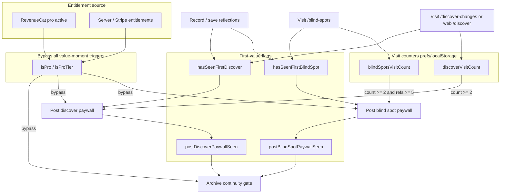

# Paywall Trigger Audit

**Scope:** ArchiveMe monorepo — Flutter mobile (`apps/voicememory_mobile`) + Next.js web (`app/`, `components/`, `lib/`).  
**Date:** 2026-05-25  
**Mode:** Read-only audit (no code changes).

---

## Executive summary

The product uses **two parallel monetization layers**:

1. **Value-moment paywall** (`ValueMomentPaywall` / `ValueMomentPaywallCard`) — full upgrade card after free “aha” moments; driven by **visit counts** and **prefs/localStorage flags**, bypassed when **`isPro` / Pro tier**.
2. **Entitlement / upgrade CTAs** (`UpgradeCta`, `EntitlementGate`) — softer Pro upsell on specific web pages; shown when **not Pro**, often **without** visit-count gates.

**RevenueCat** supplies native store entitlements (`pro`); web uses **Stripe + `/api/billing/entitlements`**. There is **no in-app free-trial UI** in client code; Stripe **`trialing`** only affects server-side “paid” status.

**Mobile main tabs** (Record, Archive, **Discover Yourself**, Timeline, Search) do **not** mount the value-moment paywall. Paywalls appear on **pushed routes** (`/blind-spots`, `/discover-changes`) and **web** `/discover`, `/memory`, `/blind-spots`.

---

## RevenueCat & entitlement checks

| Location | Function / mechanism | Condition | Effect |
|----------|-------------------|-----------|--------|
| `apps/voicememory_mobile/lib/billing/revenuecat_service.dart` | `_mapCustomerInfo` | `info.entitlements.active['pro']?.isActive == true` | `PremiumEntitlements.isPro == true` |
| `apps/voicememory_mobile/lib/billing/billing_service.dart` | `loadEntitlements`, `_merge` | Store Pro **or** server Pro | Cached entitlements; store wins if Pro |
| `apps/voicememory_mobile/lib/billing/value_moment_paywall.dart` | `shouldBypass` | `entitlements?.isPro == true` | Skips all value-moment paywall triggers |
| `apps/voicememory_mobile/lib/widgets/value_moment_paywall.dart` | `build` | `entitlements?.isPro == true` | Card not rendered |
| `lib/billing/value-moment-paywall.ts` | `shouldBypassValueMomentPaywall` | `isProTier()`, `getCurrentTierId() === 'pro'`, or founder preview flag | Skips web value-moment paywall |
| `lib/entitlement/entitlements.ts` | `getEffectiveTierId`, `hasEntitlement` | Server snapshot when billing live; else local plan | Feature gates (export, search, open loops, archive limit) |
| `lib/server/billing-entitlements.ts` | (server) | Subscription `active` or **`trialing`** | Grants Pro tier server-side |

**Entitlement ID `pro`** (RevenueCat) is the single native paid gate. Web Pro features use entitlement IDs like `export_reports`, `semantic_search`, `open_loops`, `unlimited_archive`, `deeper_resurfacing`, `encrypted_backup` (`lib/entitlement/tiers.ts`).

---

## Value-moment paywall — core logic

### Mobile: `ValueMomentPaywallLogic`

**File:** `apps/voicememory_mobile/lib/billing/value_moment_paywall.dart`  
**State:** `MobilePrefsStore.valueMomentState()` — keys: `hasSeenFirstBlindSpot`, `hasSeenFirstDiscover`, `postBlindSpotPaywallSeen`, `postDiscoverPaywallSeen`, `blindSpotsVisitCount`, `discoverVisitCount`.

| Method | Exact condition (all require `!shouldBypass(entitlements)`) |
|--------|---------------------------------------------------------------|
| `shouldShowPostBlindSpot` | `reflectionCount >= 5` **AND** `hasSeenFirstBlindSpot` **AND** `blindSpotsVisitCount >= 2` **AND** `!postBlindSpotPaywallSeen` |
| `shouldShowPostDiscover` | `hasSeenFirstDiscover` **AND** `discoverVisitCount >= 2` **AND** `!postDiscoverPaywallSeen` (no minimum reflection count) |
| `shouldGateContinuity` | `hasSeenFirstBlindSpot` **AND** `hasSeenFirstDiscover` **AND** `postBlindSpotPaywallSeen` **AND** `postDiscoverPaywallSeen` |

### Web: `lib/billing/value-moment-paywall.ts`

**Storage key:** `voicememory_value_moment_paywall` (localStorage).  
**Reflection target:** `VALUE_MOMENT_REFLECTION_TARGET` = `BLIND_SPOT_MIN_REFLECTIONS` = **5**.

Same boolean logic as mobile for the three surfaces, plus `readValueMomentState()` reason codes for debugging.

### Presentation

| Platform | Component | CTA behavior |
|----------|-----------|--------------|
| Mobile | `ValueMomentPaywallCard` | Primary → `context.push('/subscription')`; dismiss → marks post paywall seen |
| Web | `ValueMomentPaywall` | CTA → auth `pro_paywall` then Stripe checkout or `/pricing?...`; dismiss → rejection/interest prompts |

---

## Trigger table

| Trigger | Condition | Screen / route | Recording count | User sees (free user) |
|---------|-----------|----------------|-----------------|------------------------|
| **Post blind spot (mobile)** | `shouldShowPostBlindSpot` true | `/blind-spots` (`BlindSpotsScreen`) | **≥ 5** eligible reflections; review must exist | Full paywall card at bottom of insight |
| **Post blind spot (web)** | `shouldShowValueMomentPaywall('blind_spot')` | `/blind-spots` (`BlindSpotReview`) | **≥ 5** (`BLIND_SPOT_MIN_REFLECTIONS`) | `ValueMomentPaywall` at bottom |
| **Post discover (mobile)** | `shouldShowPostDiscover` true | `/discover-changes` (`DiscoverScreen`) — *not* Discover tab | Any eligible entries on 2nd+ load | Paywall card below change feed (if not continuity-gated) |
| **Post discover (web)** | `shouldShowValueMomentPaywall('discover')` | `/discover` (`TheoryChangeFeed`) | No extra minimum beyond having feed data | Paywall at bottom of Discover page |
| **Archive continuity (mobile)** | `shouldGateContinuity` true | `/discover-changes` | N/A (gate replaces feed) | **Only** paywall card — no change list |
| **Archive continuity (web)** | `shouldGateArchiveContinuity` via `ValueMomentContinuityGate` | `/discover` (theory sections), `/memory` supporting | After both post paywalls marked seen | Paywall instead of gated children |
| **Archive continuity (web, mount)** | `(stats.reflectionCount ?? 0) >= 5` **and** inner `shouldShow` | `/memory` (`EvidenceArchiveHome` supporting) | **≥ 5** | `ValueMomentPaywall` if `freeValueUsed` flags also true |
| **Protect archive (mobile)** | `GuestFirstAuth.shouldShowProtectBanner` | Record (`ProtectArchiveBanner`) | **≥ 1** local entry | Email sign-in banner — **not** Pro paywall |
| **Upgrade CTA export (web)** | `!isProUser()` | `/export` | None | Soft upgrade card always |
| **Upgrade CTA search (web)** | `!isProUser()` | `/search` | None | Compact upgrade strip always |
| **Upgrade CTA insights (web)** | `!isProUser()` | `/insights` | None | Soft upgrade card always |
| **Entitlement gate open loops (web)** | `!hasEntitlement('open_loops')` | `/open-loops` | N/A | `UpgradeCta` instead of children |
| **Archive entry cap (web)** | `!hasEntitlement('unlimited_archive')` && entries > 7 | Storage / read paths | **> 7** stored | Older entries locked (functional, not modal) |
| **Pricing primary CTA (web)** | User navigates to `/pricing` | `/pricing` | None | Pricing page + checkout (voluntary) |
| **Subscription (mobile)** | User navigates | `/subscription`, `/pricing` | None | `MobileSubscriptionScreen` (voluntary) |
| **Account pricing (mobile)** | User taps | Account → `Pricing` | None | Opens subscription screen |
| **Archive worth / drawer (mobile)** | User taps | Archive drawer, tools | None | Links to `/subscription` or `/blind-spots` |
| **Paywall CTA on archive home (web)** | `getPlanId() !== 'pro' && reflectionCount >= 5` | `/memory` action area | **≥ 5** | Primary button text → `/pricing` (not full card) |
| **Onboarding** | — | `/onboarding` | — | **No paywall** |
| **Discover Yourself tab (mobile)** | — | `/discover-yourself` | — | **No paywall** |
| **Archive belief tab (mobile)** | — | `/archive-belief` | — | **No paywall** |
| **Record tab (mobile)** | — | `/record` | — | **No paywall** (only protect banner) |

---

## Per-trigger detail

### 1. Post blind spot paywall

| Field | Detail |
|-------|--------|
| **Files** | Mobile: `blind_spots_screen.dart` → `value_moment_paywall.dart`. Web: `BlindSpotReview.tsx`, `BlindSpotAccelerationView.tsx` → `value-moment-paywall.ts` |
| **Functions** | `shouldShowPostBlindSpot` / `shouldShowValueMomentPaywall('blind_spot')`; visits: `recordBlindSpotsVisit` / `recordBlindSpotsPageVisit` |
| **First-seen flags** | Mobile: `markFirstBlindSpotSeen()` when `BlindSpotLocalEngine.buildReview` returns non-null. Web: `markFirstBlindSpotSeen()` when main review `kind === 'ready'` |
| **User action** | Open **Archive Insight** / blind spots **twice** (second time after first review was shown) |
| **Fresh install** | No — needs prefs writes + 2 visits |
| **Recordings** | **Yes — ≥ 5** |
| **Paid entitlement** | **No** — shown to free users; hidden if Pro |

### 2. Post discover paywall

| Field | Detail |
|-------|--------|
| **Files** | Mobile: `discover_screen.dart` (`/discover-changes`). Web: `TheoryChangeFeed.tsx` (`/discover`) |
| **Functions** | `recordDiscoverVisit` on each load; `markFirstDiscoverSeen` on first successful load; `shouldShowPostDiscover` |
| **User action** | Open **What Changed** (mobile) or **Discover** page (web) **twice** |
| **Fresh install** | No |
| **Recordings** | Mobile: any non-empty eligible journal; **no 5-reflection rule** for discover paywall |
| **Paid entitlement** | No |

**Note:** Main shell **Discover** tab is `DiscoverYourselfScreen` — **no** paywall logic.

### 3. Archive continuity gate

| Field | Detail |
|-------|--------|
| **Files** | Mobile: `discover_screen.dart` (`_gateContinuity`). Web: `ValueMomentContinuityGate.tsx`, `TheoryChangeFeed.tsx`, `EvidenceArchiveHome.tsx` |
| **Functions** | `shouldGateContinuity` / `shouldGateArchiveContinuity` |
| **Condition** | All four flags true: first blind spot seen, first discover seen, **both** post paywalls dismissed/seen |
| **User action** | Return to discover/changes (or discover on web) **after** dismissing both prior paywalls |
| **Fresh install** | No |
| **Recordings** | Implicit (needed to reach prior paywalls) |
| **Paid entitlement** | No |

### 4. Protect archive banner (auth, not paywall)

| Field | Detail |
|-------|--------|
| **File** | `protect_archive_banner.dart`, `guest_first_auth.dart` |
| **Function** | `shouldShowProtectBanner(isSignedIn: false, hasLocalArchive: true)` |
| **User action** | Record at least once; open Record while signed out |
| **Fresh install** | After first save |
| **Recordings** | **≥ 1** |
| **Paid entitlement** | No |

### 5. Web UpgradeCta surfaces

| Field | Detail |
|-------|--------|
| **File** | `components/billing/UpgradeCta.tsx` |
| **Function** | `if (isProUser()) return null` else render card → `/pricing` |
| **User action** | Visit `/export`, `/search`, or `/insights` |
| **Fresh install** | **Yes** — visible immediately on those pages if not Pro |
| **Recordings** | No |
| **Paid entitlement** | No |

### 6. Web EntitlementGate (open loops)

| Field | Detail |
|-------|--------|
| **File** | `components/billing/EntitlementGate.tsx`, `app/open-loops/page.tsx` |
| **Function** | `hasEntitlement('open_loops')` |
| **User action** | Open Open Loops without Pro |
| **Fresh install** | **Yes** on that page |
| **Recordings** | No |
| **Paid entitlement** | Yes — requires `open_loops` entitlement |

### 7. Voluntary subscription / pricing

| Field | Detail |
|-------|--------|
| **Mobile** | `account_screen.dart` → `/subscription`; `scaffold_shell.dart` overflow → `/pricing`; paywall card CTAs |
| **Web** | `/pricing`, footer links, `SiteHeader`, paywall redirect |
| **Trigger** | Explicit navigation only |
| **Fresh install** | User-initiated only |
| **Recordings** | No |
| **Paid entitlement** | N/A (destination) |

---

## Trial logic

| Finding | Location |
|---------|----------|
| **No client trial period UI** | No `trial`, `freeTrial`, or introductory pricing flows in Dart/TS UI |
| **Stripe `trialing`** | `lib/server/billing-entitlements.ts`, `stripe-webhook-handler.ts` — treats as paid for entitlements |
| **Effect** | User with trialing subscription is **Pro** → all paywall triggers bypassed |

---

## Time-based triggers (related, not value-moment paywall)

| Mechanism | File | Notes |
|-----------|------|-------|
| Premium mention cooldown | `lib/monetization/monetization-restraint.ts` | `dismissPremiumLine(14)` — 14-day suppression |
| Session premium cap | Same | One premium mention per session on allowed surfaces |
| Belief recall / return prompts | `lib/retention/*` | Retention surveys — not checkout paywall |

None of these show the **ValueMomentPaywall** card on a timer alone.

---

## Onboarding triggers

**None.** `OnboardingScreen` / web onboarding do not call paywall logic.

---

## Archive feature triggers (mobile tab)

| Surface | Paywall? |
|---------|----------|
| `ArchiveBeliefScreen` | **No** |
| Archive V1, evidence trail, living archive | **No** |
| `archive_progress_identity_card` at 0 recordings | Empty state only |
| Links to `/blind-spots` | Leads to paywall **only after** blind-spot visit rules |

Web `/memory`: optional continuity paywall in supporting column (≥ 5 reflections + state flags); pricing CTA in action area when not Pro and ≥ 5 reflections.

---

## Discover feature triggers

| Route | Paywall |
|-------|---------|
| Mobile tab `/discover-yourself` | **None** |
| Mobile `/discover-changes` | Post-discover + continuity |
| Web `/discover` | Post-discover + continuity gates |
| Web `/discover-changes` | Redirects to discover-yourself on mobile shell N/A |

---

## Settings / account upgrade

| Platform | Control | Automatic? |
|----------|---------|------------|
| Mobile Account | `OutlinedButton` → `/subscription` | No — user tap |
| Mobile Settings | No dedicated upgrade in audited settings screen | — |
| Web Settings | No value-moment paywall in `app/settings/page.tsx` | — |
| Web Account / header / footer | Links to `/pricing` | No |

---

## Tests & documentation

| Asset | Confirms |
|-------|----------|
| `apps/voicememory_mobile/test/value_moment_paywall_test.dart` | 1st blind-spot visit no paywall; 2nd with 5+ yes; &lt;5 never; Pro bypass |
| `scripts/validate-value-moment-paywall.mjs` | Web parity checks |
| `apps/voicememory_mobile/REVENUECAT_PRODUCTION_AUDIT.md` | Maps surfaces to logic |

---

## Answers

### What is the earliest possible moment a user can see the paywall?

**Depends on platform and surface:**

1. **Earliest automatic full paywall card (mobile):** **Second visit** to `/discover-changes` (`DiscoverScreen`), if the user already has eligible journal entries and is not Pro — **does not require 5 reflections** for the discover post-paywall. First visit sets `hasSeenFirstDiscover` and `discoverVisitCount = 1`.

2. **Earliest automatic full paywall card (mobile, pattern review):** **Second visit** to `/blind-spots` with **≥ 5** reflections and a successful local blind-spot review on the first visit.

3. **Earliest soft upgrade (web only):** **First visit** to `/export`, `/search`, or `/insights` as a non-Pro user — `UpgradeCta` renders immediately (upgrade strip, not the full value-moment card).

4. **Fresh install, default mobile journey (Record → Archive → Discover tab):** **No paywall** until user navigates to **Blind Spots** or **What Changed** and satisfies visit/reflection rules.

5. **Voluntary:** Opening `/pricing` or `/subscription` at any time.

**Strict earliest for the canonical “Keep the evolving archive alive” value-moment card:**  
- **Web:** 2nd load of `/discover` (with feed hydrated) or 2nd load of `/blind-spots` with 5+ reflections.  
- **Mobile:** 2nd load of `/discover-changes` (lowest bar) or 2nd load of `/blind-spots` (needs 5+ reflections).

### Can a user reach the core ArchiveMe value before seeing the paywall?

**Yes.**

Core value is available **without** hitting the value-moment paywall:

| Capability | Gated by value-moment paywall? |
|------------|-------------------------------|
| Voice / text capture | **No** |
| Local journal & archive belief UI (mobile tab) | **No** |
| Discover Yourself dashboard (mobile tab) | **No** |
| Timeline, Search (mobile) | **No** |
| First blind-spot / discover “free” views (1st visit) | **No** paywall on first visit |
| Web memory/archive belief home | **No** (continuity paywall only after prior paywalls dismissed + flags) |

Paywall is designed to appear **after** “first working belief” / discover value (`value_moment_paywall.dart` copy; `markFirstBlindSpotSeen` / `markFirstDiscoverSeen`). Product intent in code comments: **“no paywall before first value.”**

**Caveats (not value-moment card, but Pro positioning):**

- Web **UpgradeCta** on export/search can appear before deep archive value if user visits those pages early.
- Web **7-entry free archive limit** can affect access to older reflections without showing the paywall card.
- **Protect archive** email banner on Record is auth backup, not subscription.

---

## Architecture diagram

---

## Files reference (primary)

| Area | Path |
|------|------|
| Mobile paywall logic | `apps/voicememory_mobile/lib/billing/value_moment_paywall.dart` |
| Mobile paywall UI | `apps/voicememory_mobile/lib/widgets/value_moment_paywall.dart` |
| Web paywall logic | `lib/billing/value-moment-paywall.ts` |
| Web paywall UI | `components/billing/ValueMomentPaywall.tsx` |
| Continuity gate | `components/billing/ValueMomentContinuityGate.tsx` |
| RevenueCat | `apps/voicememory_mobile/lib/billing/revenuecat_service.dart` |
| Billing merge | `apps/voicememory_mobile/lib/billing/billing_service.dart` |
| Web entitlements | `lib/entitlement/entitlements.ts` |
| Upgrade CTA | `components/billing/UpgradeCta.tsx` |
| Types | `types/value-moment-paywall.ts` |
