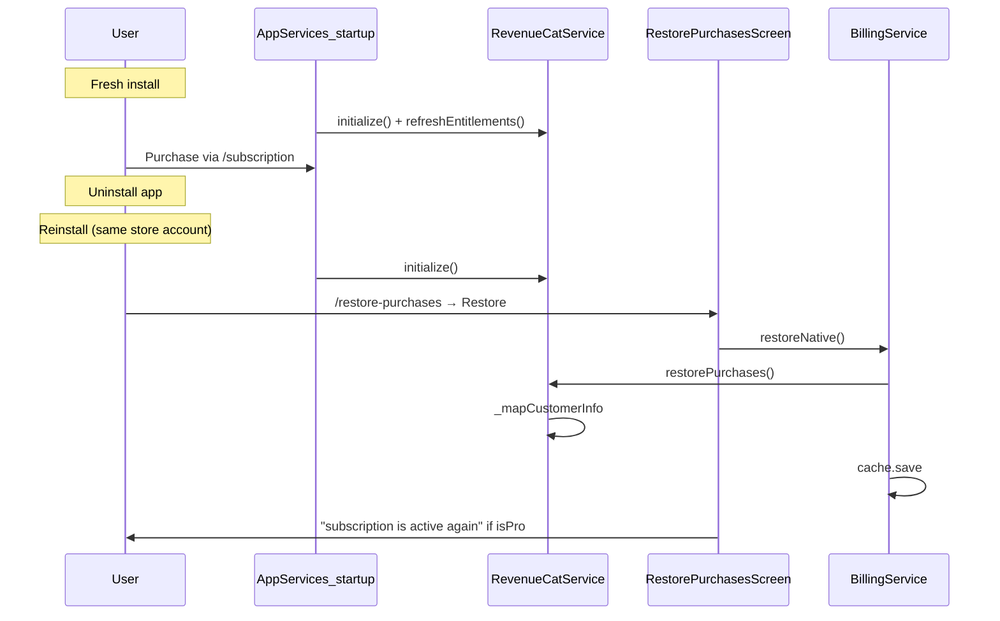

# RevenueCat production readiness audit

**Scope:** Flutter mobile (`apps/voicememory_mobile`) — native IAP via RevenueCat (`purchases_flutter: ^8.1.0`).  
**Date:** 2026-05-25  
**Mode:** Read-only static audit + evidence file review (no code changes).  
**Related:** `apps/voicememory_mobile/REVENUECAT_PRODUCTION_AUDIT.md` (deeper file index), `PAYWALL_TRIGGER_AUDIT.md` (paywall timing), `lib/mobile/revenuecat-production-verification.ts` (CI gate).

---

## Executive summary

| Question | Answer |
|----------|--------|
| Can a user successfully purchase **today**? | **Only if** the release binary includes valid `REVENUECAT_*` dart-defines **and** RevenueCat “current” offering has monthly + annual packages linked to live store products. **Committed evidence says this has not been verified** (`mobile/evidence/revenuecat_store_tested.json` all `false`). |
| Can a user successfully restore **today**? | **Same preconditions.** Restore API is implemented; evidence `restore_completed: false`. |
| Highest-risk failure remaining? | **Stale Pro from `entitlement_cache.json` when RevenueCat reports free but server/cache still says Pro** — user keeps paywall bypass without active IAP. |
| Launch-ready? | **No** — structural SDK integration is solid, but **release keys, store proof, cache downgrade, and auth↔RC identity** block production billing readiness. |

---

## Checklist (12 items)

For each item: **File** · **Function** · **Current implementation** · **Risk** · **Required action**

### 1. RevenueCat initialization

| Field | Detail |
|-------|--------|
| **File** | `apps/voicememory_mobile/lib/billing/revenuecat_service.dart` |
| **Function** | `RevenueCatService.initialize()` |
| **Current implementation** | Called from `AppServices.initialize()` after auth session load. Resolves platform API key from dart-defines; if missing, returns without configuring. Otherwise `Purchases.setLogLevel`, `Purchases.configure(PurchasesConfiguration(apiKey))`, `Purchases.addCustomerInfoUpdateListener(_onCustomerInfo)`, `refreshEntitlements()`. Idempotent via `_configured`. |
| **Risk** | **MEDIUM** — Release builds without defines silently disable billing (no startup banner). Configure failure emits free tier only (`debugPrint`). |
| **Required action** | Ensure CI/release `flutter build` passes `REVENUECAT_IOS_API_KEY` / `REVENUECAT_ANDROID_API_KEY`. Optional: surface “Subscriptions unavailable” on Account when `!isConfigured`. |

| Field | Detail |
|-------|--------|
| **File** | `apps/voicememory_mobile/lib/services/app_services.dart` |
| **Function** | `AppServices.initialize()` |
| **Current implementation** | Order: `auth.loadPersistedSession()` → `RevenueCatService.instance.initialize()` → `BillingService(...)` → `billing.startListening()`. |
| **Risk** | **LOW** |
| **Required action** | None for ordering. |

---

### 2. API keys

| Field | Detail |
|-------|--------|
| **File** | `apps/voicememory_mobile/lib/billing/revenuecat_service.dart` |
| **Function** | `_apiKey` getter |
| **Current implementation** | Compile-time only: `REVENUECAT_IOS_API_KEY`, `REVENUECAT_ANDROID_API_KEY`, fallback `REVENUECAT_API_KEY`. No secrets in repo (correct). Empty → SDK never configures. |
| **Risk** | **HIGH** — `docs/IOS_RELEASE_CHECKLIST.md` / `ANDROID_RELEASE_CHECKLIST.md` release snippets omit RevenueCat defines; only `MOBILE_BUILD_COMMANDS.md` shows placeholders for `flutter run`. |
| **Required action** | Add keys to **every** release build (CI secrets + checklists). Never commit real keys. |

---

### 3. Entitlement names

| Field | Detail |
|-------|--------|
| **File** | `apps/voicememory_mobile/lib/billing/revenuecat_service.dart` |
| **Function** | `_mapCustomerInfo`, `proEntitlementId` |
| **Current implementation** | Single entitlement: `'pro'`. Active when `info.entitlements.active['pro']?.isActive == true` → `BillingTier.pro`, `entitlementIds: ['pro']`. |
| **Risk** | **HIGH** — RevenueCat dashboard must use identifier **`pro`** exactly; any other name → paid users stay free in app. |
| **Required action** | Confirm RC entitlement id `pro` on both products. Document in runbook. |

| Field | Detail |
|-------|--------|
| **File** | `apps/voicememory_mobile/lib/models/entitlement.dart` |
| **Function** | `PremiumEntitlements.isPro` |
| **Current implementation** | `isPro` ⇔ `tier == BillingTier.pro` (not derived from `entitlementIds` list). |
| **Risk** | **LOW** for RC path if tier set correctly. |
| **Required action** | None if dashboard uses `pro`. |

---

### 4. Offering IDs

| Field | Detail |
|-------|--------|
| **File** | `apps/voicememory_mobile/lib/billing/revenuecat_service.dart` |
| **Function** | `fetchOfferings()` |
| **Current implementation** | `Purchases.getOfferings()` with 10s timeout (`billing_async_guard.dart`). Errors → `null`. |
| **Risk** | **MEDIUM** — No hardcoded offering id; depends on RC **current** offering. |
| **Required action** | Set correct offering as **Current** in RevenueCat dashboard. |

| Field | Detail |
|-------|--------|
| **File** | `apps/voicememory_mobile/lib/screens/mobile_subscription_screen.dart` |
| **Function** | `_load`, `_hasStorePackages` |
| **Current implementation** | Uses `offerings?.current` only (not `offerings.all['custom_id']`). |
| **Risk** | **MEDIUM** — Wrong current offering or empty packages → “Subscriptions are temporarily unavailable.” |
| **Required action** | Verify current offering loads on device (`/revenuecat-verify` debug screen). |

---

### 5. Product IDs

| Field | Detail |
|-------|--------|
| **File** | `apps/voicememory_mobile/lib/screens/mobile_subscription_screen.dart` |
| **Function** | `_packageForBillingPeriod` |
| **Current implementation** | Selects packages by **`PackageType.monthly`** and **`PackageType.annual`** — not by store SKU string. Prices from `package.storeProduct.priceString`. |
| **Risk** | **MEDIUM** — SKUs live only in App Store Connect / Play Console + RevenueCat; repo cannot prove alignment. Custom package types without monthly/annual → plans missing in UI. |
| **Required action** | Link ASC/Play subscription products to RC packages with standard monthly/annual types. Export product IDs from `/revenuecat-verify` → match store consoles. |

---

### 6. Paywall presentation

| Field | Detail |
|-------|--------|
| **File** | `apps/voicememory_mobile/lib/widgets/value_moment_paywall.dart` |
| **Function** | `ValueMomentPaywallCard.build`, `_openSubscription` |
| **Current implementation** | Full card on blind spot / discover / continuity surfaces when `shouldShow` and `!entitlements?.isPro`. CTA → `context.push('/subscription')`; dismiss marks paywall seen in prefs. |
| **Risk** | **LOW** — UX: opening subscription marks paywall “seen” even if user does not purchase. |
| **Required action** | Product decision: optionally defer `_markSeen()` until dismiss only. |

| Field | Detail |
|-------|--------|
| **File** | `apps/voicememory_mobile/lib/billing/value_moment_paywall.dart` |
| **Function** | `shouldShowPostBlindSpot`, `shouldShowPostDiscover`, `shouldGateContinuity`, `shouldBypass` |
| **Current implementation** | Visit-count + prefs gates; bypass when `entitlements?.isPro == true`. |
| **Risk** | **MEDIUM** if stale cache shows Pro (see §10). |
| **Required action** | Fix cache downgrade (item 10). |

| Field | Detail |
|-------|--------|
| **File** | `apps/voicememory_mobile/lib/screens/mobile_subscription_screen.dart` |
| **Function** | `build` |
| **Current implementation** | Voluntary paywall: headline/body from `ValueMomentPaywallLogic`, monthly/yearly buttons, restore link. Not a RevenueCat Paywall UI template — custom Flutter UI. |
| **Risk** | **LOW** |
| **Required action** | None unless migrating to RC Paywalls v2 (not used today). |

---

### 7. Purchase flow

| Field | Detail |
|-------|--------|
| **File** | `apps/voicememory_mobile/lib/screens/mobile_subscription_screen.dart` |
| **Function** | `_purchase` |
| **Current implementation** | Resolve package → `AppServices.instance.billing.purchaseNative(package)` → snackbar → `_load()`. |
| **Risk** | **MEDIUM** — User cancel surfaces generic “Purchase could not be completed.” (no `purchaseCancelledError` handling). |
| **Required action** | Handle cancel silently; add analytics events. |

| Field | Detail |
|-------|--------|
| **File** | `apps/voicememory_mobile/lib/billing/billing_service.dart` |
| **Function** | `purchaseNative` |
| **Current implementation** | `RevenueCatService.purchasePackage` → update `_memory` → `entitlementCache.save(ent)`. |
| **Risk** | **LOW** on happy path. |
| **Required action** | Sandbox purchase + commit evidence. |

| Field | Detail |
|-------|--------|
| **File** | `apps/voicememory_mobile/lib/billing/revenuecat_service.dart` |
| **Function** | `purchasePackage` |
| **Current implementation** | `Purchases.purchasePackage` → `_mapCustomerInfo` → `_emit` to stream. |
| **Risk** | **LOW** |
| **Required action** | Physical device test. |

---

### 8. Restore flow

| Field | Detail |
|-------|--------|
| **File** | `apps/voicememory_mobile/lib/screens/restore_purchases_screen.dart` |
| **Function** | `_restore` |
| **Current implementation** | `billing.restoreNative()` → UI message + optional evidence JSON copy UI. |
| **Risk** | **LOW** implementation · **HIGH** proof gap (evidence false). |
| **Required action** | Reinstall journey; commit `restore_purchases_tested.json` + `revenuecat_store_tested.json`. |

| Field | Detail |
|-------|--------|
| **File** | `apps/voicememory_mobile/lib/billing/revenuecat_service.dart` |
| **Function** | `restorePurchases` |
| **Current implementation** | `Purchases.restorePurchases()` → map → emit. |
| **Risk** | **LOW** |
| **Required action** | Test on physical device with sandbox subscription. |

| Field | Detail |
|-------|--------|
| **File** | `apps/voicememory_mobile/lib/screens/mobile_subscription_screen.dart` |
| **Function** | `build` (Restore button) |
| **Current implementation** | Pushes `/restore-purchases`; does not auto-refresh entitlements on pop. |
| **Risk** | **LOW** — user may need to re-open subscription screen. |
| **Required action** | Optional: refresh on return from restore route. |

---

### 9. Entitlement persistence

| Field | Detail |
|-------|--------|
| **File** | `apps/voicememory_mobile/lib/storage/entitlement_cache.dart` |
| **Function** | `save`, `load`, `clear` |
| **Current implementation** | JSON file `entitlements.json` in app documents. Written on purchase/restore and when merged result is Pro. |
| **Risk** | **HIGH** — Not cleared when IAP lapses (see merge). |
| **Required action** | Overwrite with `free` when store refresh returns non-Pro. |

| Field | Detail |
|-------|--------|
| **File** | `apps/voicememory_mobile/lib/billing/billing_service.dart` |
| **Function** | `_merge`, `loadEntitlements` |
| **Current implementation** | `if (store.isPro) return store; return server ?? store`. When RC configured and free, stale **server/cache Pro** can still win. |
| **Risk** | **CRITICAL** |
| **Required action** | When `_revenueCat.isConfigured`, trust store tier for IAP truth; clear cache on downgrade. |

| Field | Detail |
|-------|--------|
| **File** | `apps/voicememory_mobile/lib/billing/revenuecat_service.dart` |
| **Function** | `_latest`, `entitlementStream`, listener |
| **Current implementation** | In-memory `_latest` + broadcast stream; listener updates on CustomerInfo changes. |
| **Risk** | **LOW** |
| **Required action** | None. |

---

### 10. Pro feature gating

| Field | Detail |
|-------|--------|
| **File** | `apps/voicememory_mobile/lib/billing/value_moment_paywall.dart` + `lib/widgets/value_moment_paywall.dart` |
| **Function** | `shouldBypass` / `build` (`isPro`) |
| **Current implementation** | **Only** value-moment paywall cards and discover continuity gate use `isPro`. No hard locks on record, archive, export, search, deep dive. |
| **Risk** | **MEDIUM** — Paywall copy promises export / full history; **export is free** on mobile (`export_screen.dart` has no entitlement check). |
| **Required action** | Align marketing with policy: either gate features or update copy. |

| Field | Detail |
|-------|--------|
| **File** | `apps/voicememory_mobile/lib/screens/discover_screen.dart` |
| **Function** | `_load`, `build` (`_gateContinuity`) |
| **Current implementation** | When `shouldGateContinuity` and not Pro, replaces change feed with paywall card only. |
| **Risk** | **MEDIUM** (stale Pro bypass) |
| **Required action** | Fix entitlement persistence. |

---

### 11. Subscription status refresh

| Field | Detail |
|-------|--------|
| **File** | `apps/voicememory_mobile/lib/billing/revenuecat_service.dart` |
| **Function** | `refreshEntitlements`, `_onCustomerInfo` |
| **Current implementation** | `getCustomerInfo()` on init and manual refresh; listener on RC updates. Timeout/error → emit **free** (does not keep last Pro in RC service). |
| **Risk** | **MEDIUM** — `BillingService.loadEntitlements` can still merge cached/server Pro after RC says free. |
| **Required action** | Fix merge + cache (item 9). |

| Field | Detail |
|-------|--------|
| **File** | `apps/voicememory_mobile/lib/api/api_client.dart` |
| **Function** | `getEntitlements` |
| **Current implementation** | `GET /api/billing/entitlements` when backend configured; 401/503/non-2xx → free. Used in `loadEntitlements` merge path (Stripe/web entitlements). |
| **Risk** | **LOW** for IAP-only users offline; **MEDIUM** when signed in with stale server tier. |
| **Required action** | Prefer store when RC configured. |

| Field | Detail |
|-------|--------|
| **File** | `apps/voicememory_mobile/lib/services/auth_service.dart` |
| **Function** | (sign-in / sign-out) |
| **Current implementation** | **Does not** call `RevenueCatService.logIn` / `logOut`. RC uses anonymous app user until linked. |
| **Risk** | **MEDIUM** — Cross-device restore still works via store account; account merge in RC dashboard harder. |
| **Required action** | `logIn(stableUserId)` after sign-in; `logOut()` on sign-out. |

---

### 12. Offline behavior

| Field | Detail |
|-------|--------|
| **File** | `apps/voicememory_mobile/lib/billing/billing_async_guard.dart` |
| **Function** | `withBillingTimeout` |
| **Current implementation** | 10s timeout on offerings, `getCustomerInfo`, server entitlements → `null` / fallback. |
| **Risk** | **MEDIUM** |
| **Required action** | Distinguish timeout vs unavailable in UI (optional). |

| Field | Detail |
|-------|--------|
| **File** | `apps/voicememory_mobile/lib/billing/billing_service.dart` |
| **Function** | `loadEntitlements` |
| **Current implementation** | On server error: `serverEnt = await _cache.load() ?? free`. Offline + prior Pro cache → **may show Pro without network**. |
| **Risk** | **HIGH** |
| **Required action** | When RC configured, do not promote cached server Pro over store; TTL or clear on store free. |

| Field | Detail |
|-------|--------|
| **File** | `apps/voicememory_mobile/lib/screens/mobile_subscription_screen.dart` |
| **Function** | `_load` |
| **Current implementation** | If not configured: immediate “Subscriptions are temporarily unavailable.” Purchase/restore require network (store APIs). |
| **Risk** | **LOW** — expected. |
| **Required action** | None. |

---

## A. Purchase test — trace

```mermaid
sequenceDiagram
  participant User
  participant Paywall as ValueMomentPaywallCard_or_Account
  participant Sub as MobileSubscriptionScreen
  participant Bill as BillingService
  participant RC as RevenueCatService
  participant Store as AppStore_or_Play

  User->>Paywall: Tap CTA / View plans
  Paywall->>Sub: push /subscription
  Sub->>RC: fetchOfferings()
  RC->>Store: SDK offerings
  Sub->>Bill: loadEntitlements(forceRefresh)
  Bill->>RC: refreshEntitlements()
  Bill->>Bill: merge(server, store)
  User->>Sub: Tap Monthly or Yearly
  Sub->>Bill: purchaseNative(package)
  Bill->>RC: purchasePackage
  RC->>Store: native purchase sheet
  Store-->>RC: CustomerInfo
  RC->>RC: _mapCustomerInfo (pro active?)
  RC->>Bill: entitlementStream + return ent
  Bill->>Bill: _memory = ent; cache.save
  Sub->>Sub: SnackBar + _load()
  Sub->>User: "active subscription" if isPro
```

| Step | File | Function | Expected if configured |
|------|------|----------|------------------------|
| Paywall CTA | `lib/widgets/value_moment_paywall.dart` | `_openSubscription` | Navigates to `/subscription` |
| Load products | `lib/screens/mobile_subscription_screen.dart` | `_load` | Monthly/yearly buttons with prices |
| Purchase | `lib/billing/revenuecat_service.dart` | `purchasePackage` | `isPro == true` |
| UI unlock | `lib/widgets/value_moment_paywall.dart` | `build` | Card hidden (`isPro`) |
| Continuity | `lib/screens/discover_screen.dart` | `build` | Feed visible if not gated |

**Blockers today:** Missing API keys in build → step “Load products” fails. Evidence `purchase_completed: false`, `entitlement_received: false`.

---

## B. Restore test — trace



| Step | Verification |
|------|----------------|
| Reinstall | RC anonymous user may differ unless `logIn` used — restore relies on **store account**, not app user id |
| Restore API | `Purchases.restorePurchases()` implemented |
| Evidence | `mobile/evidence/revenuecat_store_tested.json` → `restore_completed: false` |

**Required action:** Physical TestFlight/Internal testing track: purchase → delete app → reinstall → Restore → commit evidence with `success: true`.

---

## C. Gate audit — features requiring Pro (mobile)

**Important:** On mobile, **Pro does not hard-disable** most features. Pro primarily **hides paywall cards** and **unlocks discover continuity feed**. Server-side Stripe entitlements can grant Pro on web only; mobile merge can also grant Pro via `/api/billing/entitlements` when signed in.

| Feature | Free | Pro | File |
|---------|------|-----|------|
| Record voice / text capture | Yes | Yes | `record_screen.dart`, `capture_pipeline_service.dart` |
| Archive belief home (V1) | Yes | Yes | `archive_belief_screen.dart` |
| Discover Yourself tab | Yes | Yes | `discover_yourself_screen.dart` |
| Timeline / Search tabs | Yes | Yes | shell routes |
| Archive Deep Dive | Yes (≥5 evidence) | Yes | `archive_deep_dive_screen.dart` |
| Blind spot **content** (insight body) | Yes | Yes | `blind_spots_screen.dart` |
| Post–blind-spot **paywall card** | Shown (2nd visit, ≥5 reflections) | Hidden | `blind_spots_screen.dart`, `value_moment_paywall.dart` |
| What Changed **feed** | Yes (unless continuity gated) | Yes | `discover_screen.dart` |
| Post–discover **paywall card** | Shown (2nd visit) | Hidden | `discover_screen.dart` |
| Discover **continuity gate** (feed replaced by paywall) | Gated | Full feed | `discover_screen.dart` (`shouldGateContinuity`) |
| Export archive (local JSON share) | **Yes** | **Yes** | `export_screen.dart` (no `isPro` check) |
| Account / sign-in / sync | Yes | Yes | `account_screen.dart` |
| Subscription purchase UI | Yes (voluntary) | Sees “active” state | `mobile_subscription_screen.dart` |
| Native push / FCM | Yes | Yes | Not Pro-gated |
| RevenueCat verify screens | Debug only (`kDebugMode`) | N/A | `production_navigation.dart` |

**Paywall marketing bullets** (export, full history) in `ValueMomentPaywallCard` are **copy only** — not enforced in code.

**Web (reference):** Export, semantic search, open loops, archive cap, etc. use `lib/entitlement/tiers.ts` — separate from RevenueCat `pro`.

---

## D. Failure audit — simulated behavior

| Scenario | Code path | App behavior | Risk |
|----------|-----------|--------------|------|
| **Network failure** (socket) during purchase | `purchasePackage` throws → `userFacingErrorMessage` | SnackBar: connection/server message; user stays free unless cache falsely Pro | MEDIUM |
| **Network timeout** (10s) on offerings/refresh | `withBillingTimeout` → `null` | Subscription screen: “temporarily unavailable” or timeout message; may use `rc.latestEntitlements` | MEDIUM |
| **RevenueCat unavailable** (no API key) | `initialize()` returns early; `isConfigured == false` | `SubscriptionCopy.temporarilyUnavailable`; restore disabled message | HIGH in release if keys omitted |
| **RevenueCat configure throws** | `catch` in `initialize` | Billing disabled; free tier emitted | MEDIUM |
| **Cancelled purchase** | Exception from `Purchases.purchasePackage` | Generic “Purchase could not be completed.” (no dedicated cancel copy) | LOW UX |
| **Expired subscription** (store inactive) | `refreshEntitlements` → `isPro false` | RC layer correct; **UI may still Pro** via `_merge` + cache | **CRITICAL** |
| **Missing entitlement** (wrong RC id) | `_mapCustomerInfo` → free | User paid but remains free; paywalls persist | HIGH |
| **Wrong offering** (empty current / wrong packages) | `_hasStorePackages` false | “Subscriptions are temporarily unavailable”; restore hint still shown if configured | HIGH |
| **Server entitlements 503** | `getEntitlements` → free | Falls back to cache in `loadEntitlements` | MEDIUM |
| **Offline open app** | `loadEntitlements` uses cache | May show Pro from old cache | HIGH |

---

## Production evidence (committed)

| File | Status |
|------|--------|
| `mobile/evidence/revenuecat_store_tested.json` | `success: false`, all journey flags `false`, empty device/platform |
| `mobile/evidence/restore_purchases_tested.json` | `success: false` |

CI: `npm run validate:revenuecat-production` → **FAIL** until evidence complete (`lib/mobile/revenuecat-production-verification.ts`).

---

## Dev / verification surfaces (not production UX)

| Route | Screen | Gate |
|-------|--------|------|
| `/revenuecat-verify` | `RevenueCatVerificationScreen` | `kDebugMode` + router redirect |
| `/restore-production-verify` | `RestoreProductionVerificationScreen` | `kDebugMode` |
| Web `/internal/revenuecat-verification` | `RevenueCatVerificationPanel` | Internal token |

---

## Final answers

### 1. Can a user successfully purchase today?

**Conditionally yes in code; operationally unproven.**

- **Yes** if: production build includes valid RevenueCat public SDK keys, dashboard **current** offering has **monthly + annual** packages, store products are approved, and user completes native purchase.
- **No** for a default release build without dart-defines (SDK disabled → “Subscriptions are temporarily unavailable”).
- **No committed proof** that anyone completed purchase on device (`revenuecat_store_tested.json`).

### 2. Can a user successfully restore today?

**Same as purchase** — `restorePurchases()` is wired; **not proven** in evidence. Reinstall restore depends on same Apple/Google account; RC `logIn` not tied to app account.

### 3. What is the highest-risk RevenueCat failure remaining?

**Stale Pro entitlement from disk cache + server merge when RevenueCat reports an inactive subscription** (`billing_service.dart` `_merge` + `entitlement_cache.dart`). Users can keep Pro UX (no paywall) after lapse until cache is cleared manually or overwritten.

**Second:** **Release builds shipped without `REVENUECAT_*` keys** — total IAP failure in production.

**Third:** **Dashboard entitlement id ≠ `pro`** — silent total failure after payment.

### 4. Is RevenueCat launch-ready?

**No.**

| Criterion | Status |
|-----------|--------|
| SDK integrated | Yes |
| Purchase / restore UI | Yes |
| Release API keys in build pipeline | **Not documented in store checklists** |
| Physical purchase + restore evidence | **Missing** |
| Entitlement downgrade / cache | **Bug** |
| Auth ↔ RC identity | **Not wired** |
| Purchase analytics | **Missing** |
| Feature gating vs marketing | **Misaligned** (export free) |

**Launch-ready when:** (1) keys in all release builds, (2) RC dashboard `pro` + current offering + monthly/annual packages verified on device, (3) cache/merge fix shipped, (4) `revenuecat_store_tested.json` committed with `success: true` and all journey flags true, (5) optional but recommended: `logIn` on auth, cancel handling, analytics.

---

## Validation commands

```bash
# Repo root
npm run validate:revenuecat-production

# Flutter
cd apps/voicememory_mobile
flutter analyze lib/billing
flutter test
```

---

*Audit: static analysis only. Store SKU strings and live offering shapes must be confirmed in RevenueCat, App Store Connect, and Google Play Console.*
