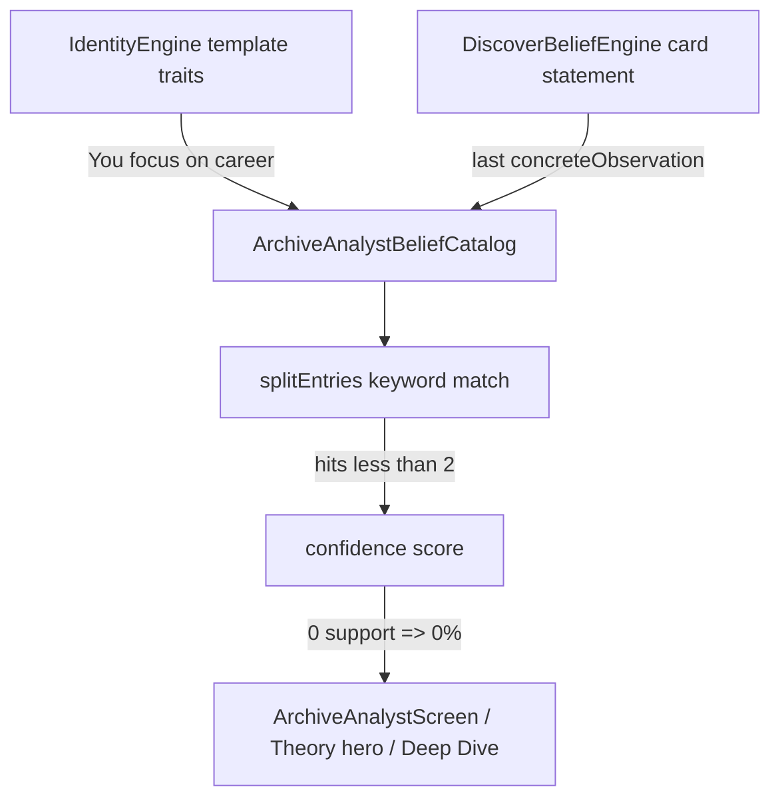

# Trait Pollution Audit — Archive Analyst & Related Surfaces

**Date:** 2026-05-25  
**Scope:** Archive Analyst (current / emerging / fading / competing / debates), Competing Beliefs, Archive Theory (hero), Archive Deep Dive, and upstream trait sources (Identity Engine → belief catalog).  
**Method:** Code path review + replay of `tool/output/archive_quality_raw.json` (5 personas × 50/100/200, `archive_quality_validation_test.dart`).  
**Code changes:** None (audit only).

Related: [COUNTER_EVIDENCE_AUDIT.md](./COUNTER_EVIDENCE_AUDIT.md) (why many rows show 0 support but huge counter counts).

---

## Executive summary

**Trait pollution is systemic.** Template identity traits and weak catalog entries are scored, ranked, and **shown in the UI** with **0% confidence** and **0 supporting recordings** on a large share of Analyst rows. The **Archive home Theory hero** can simultaneously show **0% confidence**, **0 evidence**, and a **high counter count** on a statement that does not match the Analyst’s primary belief.

| Pollution type | Prevalence (validation harness) |
|----------------|----------------------------------|
| **0% confidence rows** in Current Beliefs | **43 / 80 (53.8%)** |
| **0 evidence** supporting rows | **42 / 80 (52.5%)** |
| **Scenarios with any 0% listed** | **15 / 15 (100%)** |
| **Filler trait statements** in Current Beliefs | **38 / 80 (47.5%)** |
| **Competing Beliefs at 0%** | **18 rows** across scenarios (secondary slots) |
| **Theory: 0% + 0 evidence** | **3 / 15** (`relationshipFocused` @ all sizes) |

**Primary Analyst belief** (highest score) is never 0% in the harness, but users still see polluted **secondary** rows, **competing** list, and often a **misaligned Theory hero**.

---

## Pollution pipeline



1. **`IdentityEngine`** emits fixed trait titles (`You focus on career`, `You express confidence`, `Your archive working belief is forming from reflections`, etc.) with **internal** trait confidence (38 + frequency×9), not used after re-scoring.
2. **`ArchiveAnalystBeliefCatalog`** adds every trait + evolution lines + repeated observations **without filtering** templates.
3. **`ArchiveAnalystConfidenceEngine.splitEntries`** requires **≥2 keyword hits** for support; trait titles rarely match transcripts → **0 support**, large **counter** bucket (`hits == 0`).
4. **`ArchiveAnalystEngine`** takes top N beliefs by score into **Current Beliefs** — high-score real beliefs first, but **level 2–3** still includes **0% filler** rows (e.g. 4 beliefs: 70%, 68%, **0%**, **0%**).
5. **Competing Beliefs** lists top candidates by index — **includes 0% traits** beside primary.
6. **Theory** uses **`DiscoverBeliefEngine`** statement (often last `concreteObservation`), **not** Analyst primary — can be **work** headline on **relationship** persona with **0% / 0 ev**.

---

## 0% rows

### Where they appear

| Surface | User-visible? | Example |
|---------|---------------|---------|
| **Archive Analyst → Current Beliefs** | **Yes** | `Confidence: 0%` · `Evidence: 0 recordings` |
| **Archive Analyst → Competing Beliefs** | **Yes** | `0%` in left column |
| **Archive Analyst → Emerging / Fading** | Sometimes | 6 emerging rows at 0% in harness |
| **Archive Theory hero** | **Yes** | `0%` + `0 recordings` + low-confidence panel |
| **Deep Dive** | Indirect | Uses V1 **belief** confidence (from theory/card), not Analyst list |
| **Debates** | No for primary | Primary debate uses highest-scored belief (non-zero in harness) |

### Validation metrics

- `zeroConfidenceListed`: **non-empty in 15/15 scenarios**
- Unique filler statements at 0%: **You focus on career**, **You avoid conflict**, **You express confidence**, **You focus on money/health**, **forming from reflections**, etc.

### Example (founder @ 50 — Current Beliefs)

| Confidence | Evidence | Statement |
|------------|----------|-----------|
| 70% | 50 | I avoid difficult conversations with my cofounder… **(primary)** |
| 68% | 32 | I postpone hiring until runway feels secure… |
| **0%** | **0** | **You focus on career** |
| **0%** | **0** | **You avoid conflict** |

Source: `archive_quality_raw.json` — reproduced via `flutter test test/archive_quality_validation_test.dart`.

---

## Confidence / evidence mismatches

| Pattern | Seen in harness? | Mechanism |
|---------|------------------|-----------|
| **0% with 0 evidence** | **Yes (dominant pollution)** | `supportingCount < 3` and volume 0 → score clamps to **0** |
| **High confidence, low evidence** (`≥75%`, `<5 ev`) | **0 rows** | Stale modifier prevents this combo when support is thin |
| **>0% with 0 evidence** | **0 rows** | Score engine ties 0% to empty support in practice |
| **Theory 0% but 19–140 counter** | **Yes** | Hero still shows counter count; relationship work headline |
| **Identity trait confidence vs Analyst** | **Always mismatched** | Identity uses `38+frequency×9`; Analyst re-scores → often **0%** |

### Unsupported confidence (looks calibrated but isn’t)

- **Competing Beliefs** shows **70%** primary next to **0%** traits — implies equal footing; traits are **not** evidence-backed under `splitEntries`.
- **Emerging** rows can show **41–72%** on real observations **and** **0%** on traits in the same report — trend labels on non-zero rows only.

---

## Unsupported explanations

| Surface | Issue |
|---------|--------|
| **Theory hero — low confidence panel** | Copy is template-driven (`ArchiveTheoryStrengthening`) and **honest** when support &lt; 3, but the **statement** may still be wrong topic (work vs relationship). |
| **Theory — 0% display** | Shows numeric **0%** twice (hero + panel) with **0 recordings** — correct math, **misleading** if user reads as “the archive has no view” while Analyst primary is different. |
| **Analyst — no per-row suppression** | **0% / 0 ev** rows render with same layout as 70% rows — no “insufficient evidence” hide. |
| **Deep Dive — why section** | Uses `belief.supportingEntries` from Discover card (up to 8 reversed eligible), **not** `splitEntries` support — can **overstate** evidence vs Theory counts. |
| **Deep Dive — inquiries** | Template prompts; not pollution, but not evidence-weighted explanations. |
| **Debates** | Primary debate OK in harness; counter quotes often off-topic ([COUNTER_EVIDENCE_AUDIT.md](./COUNTER_EVIDENCE_AUDIT.md)). |

### Placeholder / gathering-evidence paths

| Path | Behavior |
|------|----------|
| `DiscoverBeliefEngine` | If no belief text: returns **“still gathering evidence…”** with **42%** and `evidenceCount = eligible.length` (not split-based). |
| `ArchiveTheoryEngine` | Returns **null** for placeholder strings — **no theory hero** in that case only. |
| Analyst catalog | Skips statements containing `still gathering evidence` |

So **placeholder confidence (42%)** appears on **Discover**, not Theory, when empty. **Theory** instead shows **0%** when statement exists but **keyword support is empty**.

---

## Filler traits (catalog sources)

### Identity template titles (`identity_engine.dart`)

| Template | Role |
|----------|------|
| `You focus on career` / `money` / `health` / `relationships` | Theme frequency ≥ threshold |
| `You express confidence` / `You are becoming more confident` | Confidence theme |
| `You avoid conflict` | Avoidance theme |
| `You seek approval` | Approval theme |
| `Your archive working belief is forming from reflections` | `_beliefBackedTrait` |
| `Your language about core themes is shifting` | Contradiction trait |

### Catalog ingestion (`archive_analyst_belief_catalog.dart`)

```61:68:apps/voicememory_mobile/lib/features/archive_analyst/archive_analyst_belief_catalog.dart
    final profile = identityEngine.build(entries: entries);
    for (final t in [
      ...profile.currentTraits,
      ...profile.emergingTraits,
      ...profile.decliningTraits,
    ]) {
      add(t.title, 'identity_trait', lastUpdated: t.lastSeen);
    }
```

No filter on `identity_trait` or template prefixes.

### Filler frequency in Current Beliefs (harness)

| Phrase | Rows |
|--------|------|
| `you focus on` | 18 |
| `forming from reflections` | 9 |
| `your archive working belief` | 9 |
| `you avoid conflict` | 7 |
| `you express confidence` | 4 |

---

## Per-surface findings

### Archive Analyst

| Section | Pollution |
|---------|-----------|
| **Current Beliefs** | **Yes** — 0% / 0 ev trait rows shown (`archive_analyst_screen.dart` `_beliefRow`) |
| **Competing Beliefs** | **Yes** — 0% filler in list (`_competingRow`) |
| **Emerging / Fading** | **Partial** — mostly real observations with non-zero confidence; some 0% |
| **Debates** | Primary generally scored; excerpts separate issue |
| **Contradictions / Blind spots** | Gated ≥60 on V1; not trait templates |

Display code (no gating):

```203:205:apps/voicememory_mobile/lib/screens/archive_analyst_screen.dart
            Text('Confidence: ${b.confidencePercent}%'),
            Text('Evidence: ${b.evidenceCount} recordings'),
            Text('Counter-evidence: ${b.counterEvidenceCount} recordings'),
```

### Competing Beliefs

- Same scored list as Analyst; **first row primary**, rest include **0% traits**.
- **No evidence count** shown — only **confidence %**, so 0% traits look like “competing hypotheses” without support context.

### Theory (Archive V1 hero)

- Built from **`DiscoverBeliefEngine`** statement, scored by **`ArchiveTheoryEngine`** + `splitEntries`.
- **Always shows** `confidencePercent`, `evidenceCount`, `counterEvidenceCount` — including **0 / 0 / N**.
- Low-confidence panel when `!isConfident` (<60%) — can show **0%** explicitly.

**Unsupported theory example** (`relationshipFocused`):

| Field | Value |
|-------|--------|
| Statement | Work delivery pressure dominates my week. |
| Confidence | **0%** |
| Evidence | **0** |
| Counter | 19 / 67 / 140 |
| Analyst primary (same run) | Partner resentment belief @ **21–40%**, **19–102** evidence |

User sees **unsupported work theory on Archive home** while Analyst primary is **relationship**-grounded.

### Deep Dive

- `confidencePercent` from **`v1.belief`** (aligned with Theory/card, **not** Analyst catalog primary).
- If belief has supporting entries from Discover card but Theory shows 0 ev, Deep Dive can show **higher apparent support** in why/timeline than Theory hero counts.
- No separate trait list — pollution is **wrong belief statement** + **counter excerpt** quality.

---

## Failure rates (validation harness)

| Metric | Rate |
|--------|------|
| Current belief rows at **0%** | 53.8% |
| Current belief rows at **0 evidence** | 52.5% |
| Scenarios with ≥1 **0%** current row | **100%** (15/15) |
| Current rows matching **filler trait** phrases | 47.5% |
| Competing rows at **0%** | 18 instances |
| Theory present with **0% and 0 evidence** | 20% (3/15) |
| Analyst **primary** at 0% | **0%** (0/15) |

---

## Files responsible

| File | Responsibility |
|------|----------------|
| `lib/features/identity_engine/identity_engine.dart` | **Generates filler trait titles** |
| `lib/features/archive_analyst/archive_analyst_belief_catalog.dart` | **Ingests traits into Analyst candidates** |
| `lib/features/archive_analyst/archive_analyst_confidence_engine.dart` | Scores traits → **0%** when no keyword support |
| `lib/features/archive_analyst/archive_analyst_engine.dart` | **No row filter**; fills current/competing/debates |
| `lib/screens/archive_analyst_screen.dart` | **Renders 0% and 0 evidence** |
| `lib/features/discover/belief_engine.dart` | **Theory statement source** (last observation / state) |
| `lib/features/archive_theory/archive_theory_engine.dart` | Theory confidence + counts |
| `lib/widgets/archive_v1/archive_theory_hero_card.dart` | **Shows 0% / 0 ev** on main Archive |
| `lib/features/archive_v1/archive_v1_builder.dart` | Wires card → theory; belief `supportingEntries` from card |
| `lib/features/archive_deep_dive/archive_deep_dive_engine.dart` | Deep Dive confidence + why evidence |
| `lib/screens/archive_deep_dive_screen.dart` | Displays confidence |
| `test/archive_quality_validation_test.dart` | `zeroConfidenceListed`, `genericPhraseHits` metrics |
| `tool/analyze_archive_v2_validation.dart` | Flags **0% beliefs listed** |

---

## Recommended fixes (audit only — not implemented)

Aligned with [NEXT_HIGHEST_ROI_IMPROVEMENTS.md](./NEXT_HIGHEST_ROI_IMPROVEMENTS.md) **#2** and **#3**:

1. **Do not list in Analyst UI** if `confidencePercent == 0` OR `evidenceCount < 3` OR statement matches identity trait templates.
2. **Do not ingest identity traits** into `ArchiveAnalystBeliefCatalog` (or mark `source: identity_trait` and filter before display).
3. **Align Theory statement** with Analyst primary (or lifecycle `current`) — single source of truth.
4. **Hide Theory hero** when `evidenceCount == 0` (show “not yet confident” without a headline statement, or use primary from catalog).
5. **Competing Beliefs** — only candidates with `evidenceCount >= 3` and `confidencePercent >= 15`.
6. **Topical counter-evidence** ([COUNTER_EVIDENCE_AUDIT.md](./COUNTER_EVIDENCE_AUDIT.md) #1) — stops inverted 0 ev / high counter display.

**Validation targets after fix:**

- `zeroConfidenceListed` → **0/15** scenarios  
- No `You focus on…` in Current Beliefs  
- Theory `evidenceCount >= 3` when hero visible  

---

## Reproduce

```bash
cd apps/voicememory_mobile
flutter test test/archive_quality_validation_test.dart
dart run tool/analyze_archive_v2_validation.dart
# Inspect metrics.zeroConfidenceListed and analyst.currentBeliefs in tool/output/archive_quality_raw.json
```

---

## Direct answers

### Can a user ever see 0% confidence?

**Yes.**

- **Archive Analyst → Current Beliefs** and **Competing Beliefs** (`archive_analyst_screen.dart`).
- **Archive Theory hero** and low-confidence panel (`archive_theory_hero_card.dart`).
- **Archive Deep Dive** header (`archive_deep_dive_screen.dart`).
- **Emerging / Fading** cards when score is 0.

### Can a user ever see 0 evidence?

**Yes.**

- Analyst: `Evidence: 0 recordings` on trait rows.
- Theory hero: `0 recordings` (and counter-evidence still shown).
- Deep Dive why line uses reflection count from supporting list — can differ, but Theory/Analyst explicitly show **0**.

### Can a user ever see an unsupported theory?

**Yes.**

- **Theory hero** can show a **statement with 0% confidence and 0 supporting recordings** while displaying large counter-evidence (e.g. relationship persona, work-themed line).
- That statement may **not match** the highest-evidence Analyst belief on the same archive.
- **Filler traits** at 0% / 0 ev are **unsupported as beliefs** but still appear as if the archive “weighed” them.

### If yes — exact files and fixes

| Problem | Files to change | Fix |
|---------|-----------------|-----|
| 0% / 0 ev in Analyst lists | `archive_analyst_engine.dart`, `archive_analyst_screen.dart` | Filter before `currentBeliefs` / `competingBeliefs`; optional empty-state copy |
| Filler traits in catalog | `archive_analyst_belief_catalog.dart`, `identity_engine.dart` | Stop adding `identity_trait` titles to Analyst; keep traits on Identity screen only |
| 0% Theory on home | `archive_theory_engine.dart`, `archive_v1_builder.dart`, `archive_theory_hero_card.dart` | Hide or replace statement when `evidenceCount < 3`; align statement with primary belief |
| Theory vs Analyst mismatch | `discover/belief_engine.dart`, `archive_v1_builder.dart` | Single primary selection shared by Theory, Lifecycle, Analyst |
| Misleading competing list | `archive_analyst_engine.dart`, `archive_analyst_screen.dart` | Competing = top **eligible** beliefs only; show evidence count |
| Deep Dive / Theory evidence drift | `archive_deep_dive_engine.dart`, `archive_v1_builder.dart` | Use same `splitEntries.supporting` for counts and excerpts |

**Counter-evidence inflation** (0 ev / many counters) is documented separately in [COUNTER_EVIDENCE_AUDIT.md](./COUNTER_EVIDENCE_AUDIT.md) — fixing counters reduces “unsupported” Theory panels that cite only counter mass.
