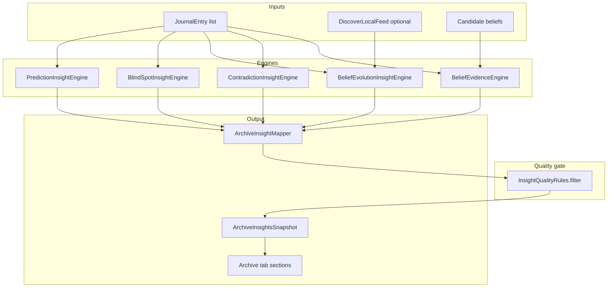
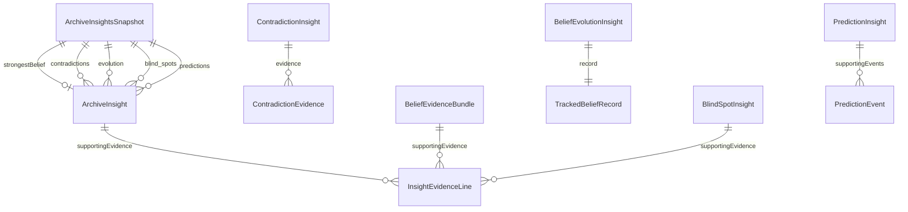

# Next-generation insight engine (mobile)

Evidence-backed insights only. No generic AI summaries, invented psychology, or beliefs without quotes.

## Architecture



### Engine responsibilities

| Engine | Path | Detects | Emit threshold |
|--------|------|---------|----------------|
| Contradiction | `insights/contradictions/` | Stated desires vs responsibility actions; statement pairs via `ContradictionDetectionService` | ≥ 3 supporting refs (desire/action); quality filter |
| Belief evolution | `insights/belief_evolution/` | Theme mention growth/shrink across archive halves; optional discover baseline | ≥ 3 mentions; no sentiment |
| Belief evidence | `insights/belief_evidence/` | `BeliefEvidenceBundle` per candidate belief | ≥ 3 reflection ids + quotes |
| Blind spot | `insights/blind_spots/` | Topic frequency vs rare positive language; achievement without satisfaction | Measurable %; ≥ 3 mentions |
| Prediction | `insights/predictions/` | Trigger → outcome within N next reflections | ≥ 3 historical pairs |

### Unified model

`ArchiveInsight` (`insights/archive_insight.dart`):

- `type`: belief | contradiction | blindSpot | evolution | prediction
- `title`, `summary`, `confidence`, `evidenceCount`
- `supportingEvidence` (`InsightEvidenceLine`: entryId, quote, recordedAt)
- UI labels: **What** = title, **Why** = summary, **Evidence** = count + sample quote

`ArchiveInsightsEngine` orchestrates engines, maps, filters, and orders:

1. Strongest belief  
2. Contradictions  
3. Beliefs changing (evolution)  
4. Blind spots  
5. Predictions  

### Quality rules (`insight_quality.dart`)

- `evidenceCount >= 3`
- `confidence >= 55`
- At least one quote ≥ 12 characters
- Rejects banned phrases (“you value growth”, etc.)

## Data model



## Files

### New

- `lib/features/insights/archive_insights_engine.dart`
- `lib/features/insights/archive_insight_mapper.dart`
- `lib/features/insights/archive_insight.dart`
- `lib/features/insights/insight_evidence.dart`
- `lib/features/insights/insight_quality.dart`
- `lib/features/insights/insight_text_signals.dart`
- `lib/features/insights/contradictions/*`
- `lib/features/insights/belief_evolution/*`
- `lib/features/insights/belief_evidence/*`
- `lib/features/insights/blind_spots/*`
- `lib/features/insights/predictions/*`
- `lib/widgets/archive/archive_insight_card.dart`
- `test/archive_insights_engine_test.dart`
- `docs/INSIGHT_ENGINE_ARCHITECTURE.md`

### Modified

- `lib/screens/archive_belief_screen.dart` — runs engine, renders insight sections
- `lib/product/belief_product_copy.dart` — section headings
- Existing engines reused: `contradiction_detection`, `discover_local`, `archive_evidence`

## Sample insights (mock corpus)

From `test/archive_insights_engine_test.dart` (`mockInsightCorpus()`):

**Contradiction — What:** Desire vs action  
**Why:** You frequently say you want freedom, but your reflections show repeated choices that increase responsibility.  
**Evidence:** Multiple refs citing “want freedom” vs “took on responsibility”.

**Prediction — What:** Recurring sequence  
**Why:** When work stress appears, the archive often sees self-worth reflections within the next few reflections.  
**Evidence:** Pairs like deadline stress → “prove myself / not good enough”.

**Blind spot — What:** Work  
**Why:** Work appears in X% of reflections, but enjoyment language appears rarely.  
**Evidence:** Cited work-heavy transcripts without positive markers.

## Blockers / data gaps

1. **Persisted belief store** — Evolution `confidence_history` is computed per run from journal halves; no cross-session `TrackedBeliefRecord` persistence yet.
2. **Discover baseline** — Stronger evolution signals need `discoverBaseline` saved after enough reflections (`ArchiveBeliefScreen` already loads it).
3. **Statement contradictions** — Pairwise reports often have `evidenceCount == 2` and are filtered out until a third cite exists or pairing logic aggregates themes.
4. **LLM-enriched beliefs** — Candidate beliefs from `ArchiveV1` / theory ranking are not yet passed into `ArchiveInsightsEngine.build`; screen uses reflections + discover feed only.
5. **Next.js web app** — This deliverable is implemented in **Flutter mobile** (`apps/voicememory_mobile`); a parallel `lib/features/insights/` tree under the Next.js repo was not requested in the active workspace path.

## Running tests

```bash
cd apps/voicememory_mobile && flutter test test/archive_insights_engine_test.dart
```
