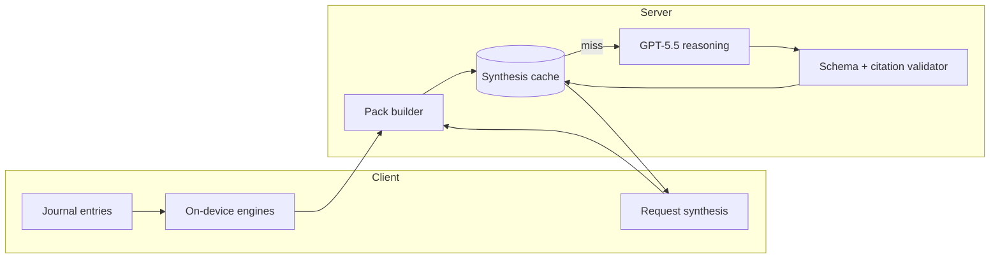

> Historical, non-authoritative. Superseded and retained for context only. Do not use for release decisions.

# GPT-5 Archive Synthesis — design plan

**Status:** Design only — **do not implement** until trust/ranking gates in [NEXT_HIGHEST_ROI_IMPROVEMENTS.md](./NEXT_HIGHEST_ROI_IMPROVEMENTS.md) pass re-validation ([ARCHIVE_V2_VALIDATION.md](./ARCHIVE_V2_VALIDATION.md)).

**Product name:** GPT-5 Archive Synthesis (monthly archive review)  
**API target (technical):** `gpt-5.5` with `reasoning_effort: medium` (upgrade to `high` only for Pro-tier or dispute resolution). “GPT-5 Thinking” maps to OpenAI’s reasoning-mode family, not a separate product surface.

---

## 1. Goal

Produce a **once-per-calendar-month** archive review that reads like a **historian’s synthesis** of the user’s recordings — not therapy, coaching, or motivational copy.

The model **narrates and connects** evidence that deterministic engines already surfaced. It does **not** replace on-device ranking, belief selection, or capture-time reflection (`/api/analyze` stays on `gpt-4o-mini` unless separately upgraded).

| Principle | Rule |
|-----------|------|
| Evidence | Every claim must cite `entryId`(s) or engine row `id` from the input pack |
| Uncertainty | Each theory/contradiction/surprise carries `confidence` + `uncertaintyNote` when evidence is thin |
| Tone | Observation language; no advice, no “you should”, no journey/healing framing ([docs/VOICE_MEMORY_PRINCIPLES.md](./docs/VOICE_MEMORY_PRINCIPLES.md)) |
| Safety | No diagnosis, no clinical labels, no retraining on user agreement metadata |

---

## 2. Relationship to existing archive stack

Today (mobile + web patterns):

| Layer | Today | After synthesis |
|-------|--------|-----------------|
| Capture | `gpt-4o-mini` → reflection fields | Unchanged |
| Read-time archive | Heuristic engines (V1, Theory, Change Feed, Lifecycle, Surprises, Deep Dive, Analyst) | **Remain source of truth** for structure and IDs |
| User agreement | `ArchiveAgreementService` (metadata) | **Excluded** from model inputs (optional analytics only) |
| Periodic review | `ArchiveAnalystEngine` (deterministic) | **Augmented** by monthly GPT synthesis report; Analyst stays as fallback/offline |

Synthesis is an **optional narrative layer** on top of the same evidence graph — not a new belief-discovery path.

---

## 3. Cadence and triggers

### 3.1 Primary schedule

- **Calendar month boundary** (user timezone): generate report for month `YYYY-MM` after the month closes **or** on first archive open in the new month if the prior month’s report is missing.
- **Minimum evidence:** same as Analyst Level 1 — **≥ 50 eligible reflections** ([ARCHIVE_ANALYST_PLAN.md](./ARCHIVE_ANALYST_PLAN.md)); below threshold, show deterministic “need more evidence” only.

### 3.2 Regeneration (strict)

| Trigger | Action |
|---------|--------|
| First open in new month | Generate if no cached report for `YYYY-MM` |
| ≥ 15 new eligible reflections since last synthesis hash | Background refresh (Batch API) |
| User taps “Refresh review” | At most **1 extra** per month (rate-limited) |
| Agreement/disagree taps | **No** regeneration |

### 3.3 Delivery modes

1. **Default:** async generation (Batch API or background job) → push/local notification “Your March archive review is ready” (optional V2).
2. **Sync fallback:** on-demand with loading state (15–90s) for power users / debug only.

---

## 4. Input pack (what the model sees)

Build a **structured JSON pack** server-side (or on-device then upload encrypted blob for signed-in users). Never send raw audio. Cap total pack size; prefer **engine outputs + curated excerpts** over full transcripts.

### 4.1 Pack sections

| Section | Source modules | Contents |
|---------|----------------|----------|
| **A. Reflection index** | Eligible `JournalEntry` list | Per entry: `id`, `createdAt`, `mood`, `emotionalIntensity`, `recurringThemes`, `concreteObservation`, `repeatedSignal`, `tensionOrContradiction` (truncated) |
| **B. Beliefs** | `ArchiveAnalystBeliefCatalog`, `DiscoverBeliefEngine`, `BeliefEvolutionService` | Candidates with `id`, statement, confidence %, support/counter counts, mention series, first/last seen |
| **C. Contradictions** | V1 + `DiscoverContradictionEngine` | Pairs, scores, `youSay` / `recordingSays`, linked entry IDs |
| **D. Blind spots** | `DiscoverBlindSpotEngine` | Rows with review id, pattern, evidence IDs |
| **E. Evidence trails** | Deep Dive / evidence trail | Top **3** supporting + **3** counter excerpts per primary theory (≤ 280 chars each, must include `entryId`) |
| **F. Change history** | `ArchiveStateSnapshot`, `ArchiveChangeFeedEngine` | Last review timestamp, beliefs strengthened/weakened, contradictions appeared/resolved, theme mention series (monthly buckets) |
| **G. Surprises** | `ArchiveSurprisesEngine` | Pre-ranked observations + evidence IDs (model may rephrase, not invent new surprise types) |
| **H. Agreement metadata** | — | **Omitted** from model input in V1 |
| **I. Pack meta** | — | `monthKey`, `eligibleCount`, `analystLevel`, `packVersion`, `generatedAt` |

### 4.2 Tiered inclusion by archive size

| Eligible reflections | Reflection index | Excerpts |
|---------------------|------------------|----------|
| 50–99 | Last 90 days + all entries touching top 5 beliefs | Max 24 excerpts |
| 100–199 | Last 12 months summary rows + 60 day detail | Max 36 excerpts |
| 200+ | Monthly aggregates + 90 day detail + top belief excerpts | Max 48 excerpts |

Entries not in the pack must not be cited in output (validator enforces).

### 4.3 Pre-pack deterministic pass (required)

Before any LLM call:

1. Run `ArchiveV1Builder`, `ArchiveAnalystEngine`, `ArchiveChangeFeedEngine`, `ArchiveSurprisesEngine` on the same entry set.
2. Attach **stable IDs** from engine rows to every pack item.
3. Compute `packContentHash` (SHA-256 of canonical JSON) for cache keys.

If heuristic primary belief fails validation gates (e.g. counter > support on primary), set `packWarnings[]` so the model must lead with uncertainty on “current theories.”

---

## 5. Output schema (nine deliverables)

Single JSON document `ArchiveSynthesisReport` returned by the model and validated before storage.

### 5.1 Shared field rules

Every list item includes:

```text
id                  — stable slug or engine id
statement           — plain language (historian tone)
confidencePercent   — 0–100 (model may adjust ±10 from engine score with justification)
uncertaintyNote     — required when confidence < 60 or packWarnings apply
evidence            — [{ entryId, excerpt?, role: "support" | "counter" | "context" }]
```

### 5.2 Sections (user-facing order)

| # | Output | Max items | Notes |
|---|--------|-----------|-------|
| 1 | **Current theories** | 3 | Working hypotheses; cite strongest support |
| 2 | **Emerging theories** | 3 | Rising mention/confidence; “may be forming” language |
| 3 | **Fading theories** | 3 | Declining or `noLongerDetected`; do not claim disappearance without lifecycle signal |
| 4 | **Contradictions** | 5 | Preserve user vs recording tension; no resolution advice |
| 5 | **Surprises** | 4 | Must map to pack surprise `id` or cite ≥3 entryIds |
| 6 | **Evidence for** | 1 primary block | Bullets tied to current theory #1 |
| 7 | **Evidence against** | 1 primary block | Include counters + contradictions |
| 8 | **Monthly review** | 1 narrative | 4–8 sentences: what shifted this month; cite change feed |
| 9 | **Trend projections** | 3 | **Conditional forecasts** — “If recent pace continues…”; each with `confidencePercent` ≤ 50 and explicit uncertainty |

### 5.3 Forbidden output patterns (post-validator)

Reject or strip lines matching:

- Coaching: `you should`, `try to`, `consider`, `work on`, `best self`, `journey`, `heal`, `breakthrough`, `transform`
- Therapy: `inner child`, `trauma`, `attachment style`, diagnostic labels
- Productivity: `habit`, `streak`, `goal`, `optimize`, `level up`
- Ungrounded: any `entryId` not in pack; surprise with &lt; 3 citations

### 5.4 Display surfaces (future)

| Surface | Behavior |
|---------|----------|
| Archive Analyst screen | New tab/section **Monthly synthesis** above deterministic report |
| Archive V1 | Optional one-line teaser linking to full synthesis (not inline wall of text) |
| Export | JSON + printable markdown for user (no training use) |

---

## 6. API and runtime architecture



### 6.1 Proposed route (not built)

- `POST /api/archive-synthesis` — authenticated; body: `monthKey`, `pack` or `devicePackHash` + encrypted pack upload
- Uses `guardOpenAiRoute` + dedicated budget kind `archive_synthesis`
- **Responses API** preferred over legacy chat completions (reasoning models; see [OpenAI reasoning guide](https://developers.openai.com/api/docs/guides/reasoning))
- `reasoning_effort: medium` default; `max_output_tokens` ≥ 25,000 per OpenAI guidance for reasoning headroom

### 6.2 Validator (deterministic, mandatory)

1. JSON schema parse (`response_format` / strict schema)
2. Every `entryId` ∈ pack.index
3. Every engine `id` ∈ pack section
4. Banned phrase scan (extend analyze route list + product principles)
5. Confidence caps: projections ≤ 50 unless ≥ 3 monthly data points in pack
6. On failure: **do not** show raw model output — fall back to `ArchiveAnalystReport` + log `synthesis_validation_failed`

### 6.3 Privacy

- Pack contains user transcripts/snippets — same trust tier as analyze; encrypted sync accounts only for server-side cache
- Retention: keep last **12** monthly reports; delete on account erasure
- **No** use of agreement responses for training or prompt tuning

---

## 7. Prompt design (sketch)

**System (static, cacheable):**

- Role: archive historian for Voice Memory / ArchiveMe
- Output: JSON only matching `ArchiveSynthesisReport` schema
- Rules: cite `entryId`; include `uncertaintyNote` when weak; never coach; never invent entries; surprises only from pack section G; projections are conditional not predictions

**User (dynamic):**

- `monthKey`, `packWarnings`, full pack JSON (compressed keys in production)

**Optional second pass (V2):**

- `gpt-5.5` `reasoning_effort: low` critic pass: “list any uncited claims” → discard report if &gt; 0

---

## 8. Cost, latency, and monthly spend estimates

**Pricing basis (April 2026 OpenAI list):** `gpt-5.5` — **$5 / 1M input**, **$0.50 / 1M cached input**, **$30 / 1M output** (includes hidden reasoning tokens). [OpenAI pricing](https://openai.com/api/pricing/). Use **Batch API** at ~50% discount for scheduled monthly jobs.

Assumptions:

- 1 synthesis per user per month (plus 20% of actives trigger one refresh)
- Pack caps from §4.2
- `reasoning_effort: medium` → reasoning tokens ≈ **2–4×** visible output tokens

### 8.1 Token budget per run

| Component | Tokens (typical @100 reflections) | Tokens (heavy @200) |
|-----------|-----------------------------------|---------------------|
| System + schema instructions | 3,500 | 3,500 |
| Structured pack (engines + index) | 12,000 | 22,000 |
| Curated excerpts | 4,000 | 6,000 |
| **Input total** | **~19,500** | **~31,500** |
| Visible JSON output | 4,000 | 5,500 |
| Reasoning (hidden, billed as output) | 12,000 | 20,000 |
| **Output total (billed)** | **~16,000** | **~25,500** |

### 8.2 Cost per synthesis (standard API)

| Archive size | Input cost | Output cost | **Total / run** |
|--------------|------------|-------------|-----------------|
| ~50 entries (smaller pack) | ~$0.06 | ~$0.35 | **~$0.41** |
| ~100 entries | ~$0.10 | ~$0.48 | **~$0.58** |
| ~200 entries | ~$0.16 | ~$0.77 | **~$0.93** |

With **prompt caching** (~70% of system+schema static): subtract ~$0.01–0.02 per run.

With **Batch API** (~50% off): **~$0.21–0.47** per run at 100 reflections.

### 8.3 Latency

| Mode | P50 | P95 |
|------|-----|-----|
| Sync `medium` reasoning | 25–45s | 60–90s |
| Sync `high` reasoning | 45–75s | 90–150s |
| Batch (async) | 5–30 min | &lt; 24h |

**UX:** treat synthesis like “report generating” — never block capture pipeline.

### 8.4 Monthly cost per active user

Define **archive-active** = opened archive ≥1× in month and ≥50 eligible reflections.

| Scenario | Runs / month | Cost / active user / month |
|----------|--------------|----------------------------|
| Lean (Batch, 100 reflections, 1.0 runs) | 1.0 | **~$0.30** |
| Typical (Batch, 100 reflections, 1.2 runs) | 1.2 | **~$0.35** |
| Heavy (sync refresh, 200 reflections, 1.5 runs) | 1.5 | **~$1.40** |
| Pro tier (`gpt-5.5-pro`, 1 run) | 1.0 | **~$2.50–4.00** |

**Fleet illustration:** 10,000 archive-active users × $0.35 ≈ **$3,500/month** inference (excluding capture analyze/whisper, which dominate today for recorders).

Compare to current capture LLM: ~$0.002–0.01 per reflection analyze ([MODEL_AUDIT.md](./MODEL_AUDIT.md)) — synthesis is **~30–50×** one reflection’s analyze cost but **≤1× per month** per active archivist.

---

## 9. Caching strategy

| Cache layer | Key | TTL / invalidation |
|-------------|-----|-------------------|
| **Report store** | `userId + monthKey` | Permanent for past months; current month overwritten on regen |
| **Pack hash** | `packContentHash` | If hash unchanged, skip LLM |
| **OpenAI prompt cache** | Static system prefix | Provider-managed; reduces input $ |
| **Client** | Last report JSON in prefs/files | Offline read; show `stale` badge if server hash differs |
| **CDN / edge** | None for PII | — |

**Invalidation rules:**

- `packContentHash` changes (new reflections, engine version bump `packVersion`)
- Manual refresh (rate-limited)
- **Not** invalidated by: agreement taps, theme UI navigation, deep dive inquiries

**Staleness UX:** show month label + “Based on N reflections through &lt;date&gt;” + link to deterministic Change Feed for live deltas.

---

## 10. Implementation effort (engineering)

No code in this phase. Rough **single strong engineer** estimate after trust gates pass:

| Phase | Scope | Effort |
|-------|--------|--------|
| **0 — Gates** | Re-run validation harness; block synthesis if `zeroConfidenceListed` or primary counter &gt; support | 3–5 days |
| **1 — Pack builder** | Server module mirroring mobile engines OR signed pack upload from device | 8–10 days |
| **2 — API + budget** | Route, `archive_synthesis` cost estimator, Batch job, storage | 5–7 days |
| **3 — Validator + schema** | Citation checker, banned phrases, golden fixtures | 5–7 days |
| **4 — Client UI** | Analyst/monthly screen, loading/error/fallback | 4–5 days |
| **5 — Eval harness** | 5 personas × 50/100/200; human rubric + automated citation tests | 5–8 days |
| **6 — Rollout** | Feature flag, privacy copy, support docs | 2–3 days |

**Total:** **~32–45 engineering days** (~6–9 weeks calendar with review/QA).

**Parallel work not required for V1:** web port of Change Feed, agreement-driven tuning, embedding search.

---

## 11. Rollout and success metrics

### 11.1 Feature flags

- `VOICEMEMORY_ENABLE_ARCHIVE_SYNTHESIS` (server)
- `archiveSynthesisBeta` (client cohort)

### 11.2 Go / no-go (extends existing gate)

Ship GPT synthesis only when:

| Metric | Current (V2 validation) | Target |
|--------|-------------------------|--------|
| `zeroConfidenceListed` scenarios | 15/15 fail | 0/15 |
| Primary `counterExceedsSupport` | ~15/15 | ≤ 3/15 |
| Seeded contradictions in Analyst | ~0 | ≥ 1 per persona |
| Automated citation pass rate on fixtures | — | ≥ 98% |
| Banned-phrase violation rate | — | 0% in eval set |

### 11.3 Product metrics (post-launch)

- % archive-actives opening monthly synthesis
- Agreement distribution (metadata only) vs synthesis confidence
- Validator failure rate & fallback rate
- Cost per active archivist vs budget cap

---

## 12. Risks and mitigations

| Risk | Mitigation |
|------|------------|
| Fluent wrong primary theory | Trust gates + `packWarnings` + low confidence copy mandatory |
| Hallucinated evidence | Validator rejects unknown `entryId`; excerpts only from pack |
| Therapy drift in long narrative | Banned phrase validator + short monthly review cap |
| Cost overrun | Batch scheduling, monthly cap 1.2 runs, budget kind in `openai-cost-estimator` |
| Latency abandonment | Async default + cached prior month while regenerating |
| Privacy backlash | Clear “processed on server” copy; opt-in beta; no agreement in prompt |

---

## 13. Explicit non-goals (V1)

- Replacing `ArchiveAnalystEngine` or on-device V1 builders
- Real-time synthesis on every archive visit
- Using user **Agree/Unsure/Disagree** to change rankings or retrain models
- Open-ended archive chat
- Next.js port of mobile-only engines (pack must be built where engines run, or parity project first)

---

## 14. Reproduce (when implemented)

```bash
# Validation gate (before enabling synthesis)
cd apps/voicememory_mobile
flutter test test/archive_quality_validation_test.dart
dart run tool/analyze_archive_v2_validation.dart

# Future synthesis eval (not yet present)
# flutter test test/archive_synthesis_validation_test.dart
```

---

## 15. Summary

GPT-5 Archive Synthesis is a **monthly, server-side, evidence-locked narrative** over deterministic archive engines. It delivers nine structured sections with **mandatory citations and uncertainty**, while **Change Feed + Analyst** remain the live, on-device truth for day-to-day visits. Expected cost is **~$0.30–0.45 per archive-active user per month** at Batch pricing for typical archives; implementation is **~6–9 weeks** after ranking/trust fixes land.

