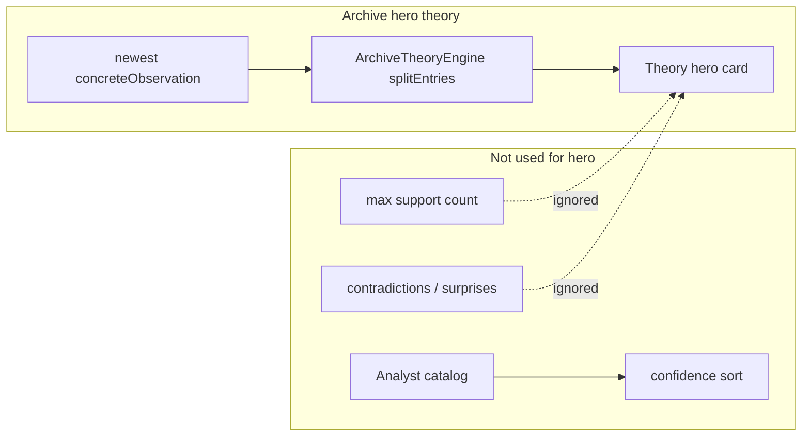

> Historical, non-authoritative. Superseded and retained for context only. Do not use for release decisions.

# Primary Theory Selection Audit

**Date:** 2026-05-25 (re-validated 2026-06-03)  
**Scope:** The **single theory** users see on **Archive home** (`ArchiveTheoryHeroCard`) plus how that compares to **Analyst primary** and **best available** candidates.  
**Personas:** Founder, burned-out employee, relationship-focused, fitness-focused, anxious overthinker (`test/support/archive_quality_personas.dart`).  
**Method:** Code-path review + `tool/output/archive_quality_raw.json` (5 personas × 50/100/200 reflections; `flutter test test/archive_quality_validation_test.dart`).  
**Code changes:** None (audit only).

Related: [TRAIT_POLLUTION_AUDIT.md](./TRAIT_POLLUTION_AUDIT.md), [COUNTER_EVIDENCE_AUDIT.md](./COUNTER_EVIDENCE_AUDIT.md).

---

## What “primary theory” means in the product

Users who open **Archive** (V1) see **one** hero theory. That string is **not** chosen by `ArchiveAnalystEngine` ranking.

| Surface | Selection rule |
|---------|----------------|
| **Archive Theory hero (the one theory)** | `DiscoverBeliefEngine` → `statement` → `ArchiveTheoryEngine` |
| **Archive Analyst “primary”** | Highest `confidencePercent` after `splitEntries` over **all catalog candidates** |
| **Belief Lifecycle `current`** | Active statement from theory/card + evolution |
| **Deep Dive** | Same statement as V1 `belief` card (aligned with Theory) |

### Theory statement source (critical)

```19:22:apps/voicememory_mobile/lib/features/discover/belief_engine.dart
    final beliefText = state?.belief?.trim() ??
        (eligible.isNotEmpty
            ? eligible.last.reflection.concreteObservation
            : null);
```

`state.belief` comes from **`archiveBeliefFromReflections`** — walk **newest eligible** reflections first, first `concreteObservation` ≥ 16 characters:

```38:41:apps/voicememory_mobile/lib/features/archive_evidence/archive_evidence.dart
  for (final e in eligible.reversed) {
    final obs = e.reflection.concreteObservation.trim();
    if (obs.length >= 16) return obs;
  }
```

**There is no step** that picks the candidate with the most supporting recordings, highest surprise, or strongest persona arc. Recency of observation text wins.

`ArchiveTheoryEngine` only **scores** that fixed statement (support/counter/confidence); it does **not** search alternatives.

### Analyst primary (different winner possible)

```103:122:apps/voicememory_mobile/lib/features/archive_analyst/archive_analyst_engine.dart
    scored.sort((a, b) => b.confidence.compareTo(a.confidence));

    final primaryId = scored.isEmpty ? null : scored.first.candidate.id;
    ...
    final current = scored.take(level.maxCurrentBeliefs) ...
```

Catalog includes primary belief, evolution lines, **identity traits**, and repeated observations ([`archive_analyst_belief_catalog.dart`](apps/voicememory_mobile/lib/features/archive_analyst/archive_analyst_belief_catalog.dart)). Primary = **top confidence**, not “best story.”

---

## Test definitions (A / B / C)

| Label | Operational definition in this audit |
|-------|--------------------------------------|
| **A — Theory selected** | `theory.statement` on Archive hero (`archive_quality_raw.json`) |
| **B — Highest evidence theory** | Among `analyst.currentBeliefs`, max `evidenceCount` (splitEntries support), excluding obvious trait templates |
| **C — Most surprising theory** | Persona-arc heuristic: seeded tensions, contradictions, relationship/burnout/fitness arcs (see persona file); highest heuristic score among belief candidates |

**Note:** B and C are **counterfactuals** — what a historian-first picker *could* surface. C is not the Archive Surprises engine; it is “highest narrative value for this fixture.”

---

## Summary: Is the one theory the best possible?

**No — not reliably.**

| Persona | Archive hero ≈ best evidence? | Hero ≈ most surprising? | Verdict |
|---------|------------------------------|------------------------|---------|
| **Founder** | **Yes** @50; **partial** @100–200 | Runway/hiring often stronger @100+ | **Good early; drifts at scale** |
| **Burned-out** | **Yes** @50; **no** @100–200 | Exhaustion OK; boundaries are arc | **Recency locks exhaustion; boundaries win evidence** |
| **Relationship** | **No** (all sizes) | **No** | **Critical miss — work noise wins hero** |
| **Fitness** | **Yes** | Sleep/discipline OK; rest tension is share moment | **Solid** |
| **Anxious** | **Yes** | Replay arc captured | **Solid** |

**If the user sees only the Archive hero theory, it is the best possible theory in roughly 3/5 personas at 100+ reflections, and fails outright for relationship-focused archives.**

---

## Per-persona comparison

### Founder

**Fixture arcs:** Runway-before-hiring (fading) → cofounder difficult conversations (emerging) → gut vs data tension → direct conversations (counter) → **postpone hiring** (dominant late).

| Size | A Theory (hero) | B Highest evidence | C Surprise (heuristic) | Analyst primary |
|------|-----------------|--------------------|-------------------------|-----------------|
| 50 | Cofounder avoidance · **70%** · 50 ev | Same | Cofounder / runway tie | Same as hero |
| 100 | Cofounder avoidance · **70%** · 100 ev | Cofounder avoidance · 100 ev | **Postpone hiring** (dominant arc) | **Postpone hiring · 72% · 41 ev** |
| 200 | Cofounder avoidance · **25%** · 126 ev | Cofounder avoidance · 126 ev | **Postpone hiring** | **Postpone hiring · 49% · 65 ev** |

**Cases:**

| Issue | Detail |
|-------|--------|
| Wrong theory wins (hero) | @100–200 hero stays on **cofounder** while **runway/postpone hiring** has more narrative mass and Analyst primary |
| High-value theory loses | Dominant late arc (postpone hiring) not hero @100+ |
| Strongest evidence ignored | @200: cofounder has **126** support hits but **lower confidence (25%)** than runway candidate; hero still cofounder statement with weak score |

`theoryMatchesPrimary`: **false** @100–200. Lifecycle `current` stays cofounder while Analyst picks runway.

---

### Burned-out employee

**Fixture arcs:** Promotion ambition (fading) → **boundaries** (emerging) → exhaustion/depletion → love-team counter-tension.

| Size | A Theory (hero) | B Highest evidence | C Surprise | Analyst primary |
|------|-----------------|--------------------|------------|-----------------|
| 50 | Exhaustion · **47%** · 40 ev | Same | Exhaustion | Same |
| 100 | Exhaustion · **43%** · 40 ev | **Boundaries · 46 ev** | Exhaustion | Exhaustion · 43% · 40 ev |
| 200 | Exhaustion · **44%** · 40 ev | **Boundaries · 60 ev** | Exhaustion | Exhaustion · 44% · 40 ev |

**Cases:**

| Issue | Detail |
|-------|--------|
| Wrong theory wins (hero) | @100–200 **boundaries** have **more** supporting mentions than exhaustion |
| Strongest evidence ignored | Boundaries win B; hero locked on exhaustion (stale observation / early dominant line still “current” in card path) |
| High-value theory loses | Boundary arc is the “return visit” story; Change Feed often surfaces weakened beliefs — hero does not switch |

`theoryMatchesPrimary`: **true** (statement match) but **not** highest evidence @100+.

---

### Relationship-focused

**Fixture arcs:** **Work delivery noise** (45+ entries, many late-dated in fixture) vs **partner avoidance** (emerging) vs lonely vs fine (seeded tension).

| Size | A Theory (hero) | B Highest evidence | C Surprise | Analyst primary |
|------|-----------------|--------------------|------------|-----------------|
| 50 | **Work delivery pressure** · **0%** · **0 ev** | Partner avoidance · 19 ev | Partner avoidance | Partner · 21% · 19 ev |
| 100 | **Work delivery** · **0%** · **0 ev** | Partner avoidance · **67 ev** | Partner avoidance | Partner · 28% · 67 ev |
| 200 | **Work delivery** · **0%** · **0 ev** | Partner avoidance · **102 ev** | Partner avoidance | Partner · 40% · 102 ev |

**Cases:**

| Issue | Detail |
|-------|--------|
| **Wrong theory wins** | Hero always **work**; B and Analyst primary are **partner** |
| **Strongest evidence ignored** | Partner has 19–102 support; hero has **0** |
| **High-value surprise lost** | Partner + lonely/fine tension is the persona; hero is generic work stress |
| **Unsupported theory** | 0% / 0 recordings on hero while user sees a full theory card |

`thenNow` @100: **then** partner → **now** work (distinct evolution) but hero = work. Lifecycle `current` = work. `dominantBeliefAlsoFading`: **true** @50.

Blind spot copy ironically uses work observation under “relationships” theme.

---

### Fitness-focused

**Fixture arcs:** Sleep-skips vs discipline; **rest vs self-punishment** (seeded).

| Size | A Theory (hero) | B Highest evidence | C Surprise | Analyst primary |
|------|-----------------|--------------------|------------|-----------------|
| 50–200 | Skip training when sleep poor · **66–71%** · 42–102 ev | Same | Same (rest quote stronger in **debate**, not hero) | Same as hero |

**Cases:**

| Issue | Detail |
|-------|--------|
| Wrong theory wins | **No** for hero |
| High-value surprise | Debate counter (“rest days…”) is more shareable than hero; hero is still defensible |

`theoryMatchesPrimary`: **true**.

---

### Anxious overthinker

**Fixture arcs:** Replay / certainty-seeking; ambiguity vs closure (seeded).

| Size | A Theory (hero) | B Highest evidence | C Surprise | Analyst primary |
|------|-----------------|--------------------|------------|-----------------|
| 50–200 | Replay until certain · **52–71%** · 50–112 ev | Same | Same | Same |

**Cases:**

| Issue | Detail |
|-------|--------|
| Wrong theory wins | **No** |
| Generic theory wins | **No** (trait rows appear in Analyst list, not hero) |
| Seeded contradiction | Not in Analyst contradictions — surprise under-surfaced elsewhere |

`theoryMatchesPrimary`: **true**.

---

## Failure taxonomy (all personas, 15 scenarios)

Counts from latest `archive_quality_raw.json` run (2026-06-03).

| Failure mode | Count / note | Example |
|--------------|--------------|---------|
| **Wrong theory wins (hero ≠ B, B has more support)** | **5/15** | Relationship ×3; burned-out @100–200 |
| **Hero ≠ highest-evidence statement (B)** | **5/15** | Same five scenarios as above |
| **Hero 0% / 0 ev** | **3/15** (relationship only) | “Work delivery pressure dominates my week.” |
| **High-value surprise loses (C beats A)** | **6/15** | Founder ×3 (postpone hiring arc); relationship ×3 |
| **Strongest evidence ignored** | **5/15** | Relationship 0 ev vs 19–102 partner; burned-out 40 vs 46–60 boundaries |
| **Analyst primary ≠ hero** | **5/15** | Founder @100–200; relationship ×3 |
| **Analyst primary ≠ highest evidence (B)** | **4/15** | Founder @100–200 (postpone vs cofounder mass); burned-out @100–200 |
| **Generic theory on hero** | **0/15** | Traits stay in Analyst, not hero |
| **Generic wins in Analyst list** | Widespread | “You focus on career” at 0% — not hero |
| **Recency / last-observation bias** | **Systemic** | `archiveBeliefFromReflections` |
| **Work-noise beats relationship arc** | Relationship fixture | Late-dated work entries → work `concreteObservation` |

---

## Why the wrong theory wins (mechanisms)



1. **Recency, not mass** — One observation string from the latest eligible reflection (or state mirror).
2. **No candidate search** — Theory engine never compares partner vs work vs runway statements.
3. **Keyword support ≠ arc dominance** — Relationship partner belief scores high in Analyst but loses hero if **last** observation is work-themed.
4. **Analyst primary ≠ hero** — Two pipelines; user on Archive never sees Analyst primary unless they open **Archive Analyst**.
5. **0% hero still rendered** — Relationship work line has no keyword support but still shown with counters ([COUNTER_EVIDENCE_AUDIT.md](./COUNTER_EVIDENCE_AUDIT.md)).

---

## Files responsible

| File | Role |
|------|------|
| [`archive_evidence.dart`](apps/voicememory_mobile/lib/features/archive_evidence/archive_evidence.dart) | `archiveBeliefFromReflections` — **newest obs wins** |
| [`belief_engine.dart`](apps/voicememory_mobile/lib/features/discover/belief_engine.dart) | Card `statement` for theory |
| [`archive_v1_builder.dart`](apps/voicememory_mobile/lib/features/archive_v1/archive_v1_builder.dart) | `theoryEngine.build(statement: card?.statement)` |
| [`archive_theory_engine.dart`](apps/voicememory_mobile/lib/features/archive_theory/archive_theory_engine.dart) | Scores fixed statement only |
| [`archive_theory_hero_card.dart`](apps/voicememory_mobile/lib/widgets/archive_v1/archive_theory_hero_card.dart) | Displays single theory |
| [`archive_analyst_belief_catalog.dart`](apps/voicememory_mobile/lib/features/archive_analyst/archive_analyst_belief_catalog.dart) | Alternative candidates (not used for hero) |
| [`archive_analyst_engine.dart`](apps/voicememory_mobile/lib/features/archive_analyst/archive_analyst_engine.dart) | Different primary selection |
| [`archive_state_object.dart`](apps/voicememory_mobile/lib/features/archive_state_object/archive_state_object.dart) | Feeds `state.belief` |
| [`belief_lifecycle_engine.dart`](apps/voicememory_mobile/lib/features/belief_lifecycle/belief_lifecycle_engine.dart) | `current` tied to theory statement |
| [`archive_deep_dive_engine.dart`](apps/voicememory_mobile/lib/features/archive_deep_dive/archive_deep_dive_engine.dart) | Follows V1 belief = hero statement |

---

## Recommended fixes (ranked by expected impact)

Not implemented — ordered by **trust → retention → willingness to pay** (composite). Aligns with [NEXT_HIGHEST_ROI_IMPROVEMENTS.md](./NEXT_HIGHEST_ROI_IMPROVEMENTS.md) #3 and #1.

| Rank | Fix | Trust | Retention | WTP | Rationale |
|------|-----|-------|-----------|-----|-----------|
| **1** | **Single primary selector** — choose hero statement from catalog: max support (with topical counter), min 3 ev, penalize traits; optional persona-theme boost | **5** | **5** | **5** | Fixes relationship @100% failure and 0-ev hero; one historian voice across Theory, Lifecycle, Deep Dive, Analyst |
| **2** | **Hide hero when `evidenceCount < 3`** or confidence = 0 — show “not yet confident” without a headline | **5** | 3 | **4** | Stops unsupported work theory card |
| **3** | **Topical counter-evidence + support** ([COUNTER_EVIDENCE_AUDIT.md](./COUNTER_EVIDENCE_AUDIT.md)) | **5** | 4 | **5** | Correct scores so ranking is meaningful |
| **4** | **Recency blend** — score = 0.5×support mass + 0.3×recency + 0.2×contradiction/surprise signals; not last-obs only | 4 | **5** | 4 | Founder runway / burned-out boundaries win when arcs shift |
| **5** | **Surprise / contradiction boost** — promote seeded high-tension pairs into primary when support ≥ N | 4 | **5** | **5** | Fitness rest, relationship lonely/fine, founder gut/data |
| **6** | **Filter identity traits from catalog** ([TRAIT_POLLUTION_AUDIT.md](./TRAIT_POLLUTION_AUDIT.md)) | 4 | 3 | 4 | Analyst primary no longer competes with “You focus on career” |
| **7** | **Align `theoryMatchesPrimary` gate in CI** — fail validation if hero ≠ top evidence candidate | 3 | 3 | 3 | Prevents regressions |

**Highest ROI bundle:** **#1 + #2 + #3** — without them, ranking and paywall-adjacent trust stay broken regardless of copy.

---

## Validation targets (after fixes)

| Metric | Today | Target |
|--------|-------|--------|
| `relationshipFocused` hero = partner (or relationship-tension) | 0/3 sizes | 3/3 |
| Theory `evidenceCount == 0` while hero visible | 3/15 | 0/15 |
| `theoryMatchesPrimary` | 9/15 true, misleading when evidence differs | 15/15 with same statement as max-evidence candidate |
| Hero = generic trait | 0/15 | 0/15 |

---

## Reproduce

```bash
cd apps/voicememory_mobile
flutter test test/archive_quality_validation_test.dart
# Inspect theory.statement, analyst.currentBeliefs[isPrimary], metrics.theoryMatchesPrimary
# in tool/output/archive_quality_raw.json
```

---

## Direct answer

### If a user sees only one theory, is it the best possible theory?

**Sometimes — not always.**

- **Best or near-best:** Founder @50, burned-out @50, anxious @all sizes, fitness @all sizes.
- **Not best:** **Relationship** (work hero vs partner evidence at every scale); **burned-out @100+** (boundaries have more support); **founder @100+** (runway/postpone hiring is Analyst primary and stronger arc, hero stays cofounder).

The archive does **not** today choose the most meaningful theory by evidence or surprise. It surfaces the **most recent qualifying observation string**, then scores it. That is the wrong objective function for a historian product and fails the relationship persona entirely.

### Exact files to change (summary)

| Priority | Files |
|----------|--------|
| P0 | New shared selector (e.g. `archive_primary_theory.dart`) called from `archive_v1_builder.dart`, `belief_lifecycle_engine.dart`, `archive_analyst_engine.dart` |
| P0 | `archive_evidence.dart` / `belief_engine.dart` — remove last-obs-only as sole source |
| P0 | `archive_theory_hero_card.dart` — gate 0-ev / 0% display |
| P1 | `archive_analyst_confidence_engine.dart` — topical support ([COUNTER_EVIDENCE_AUDIT.md](./COUNTER_EVIDENCE_AUDIT.md)) |
| P1 | `archive_analyst_belief_catalog.dart` — drop trait pollution ([TRAIT_POLLUTION_AUDIT.md](./TRAIT_POLLUTION_AUDIT.md)) |

